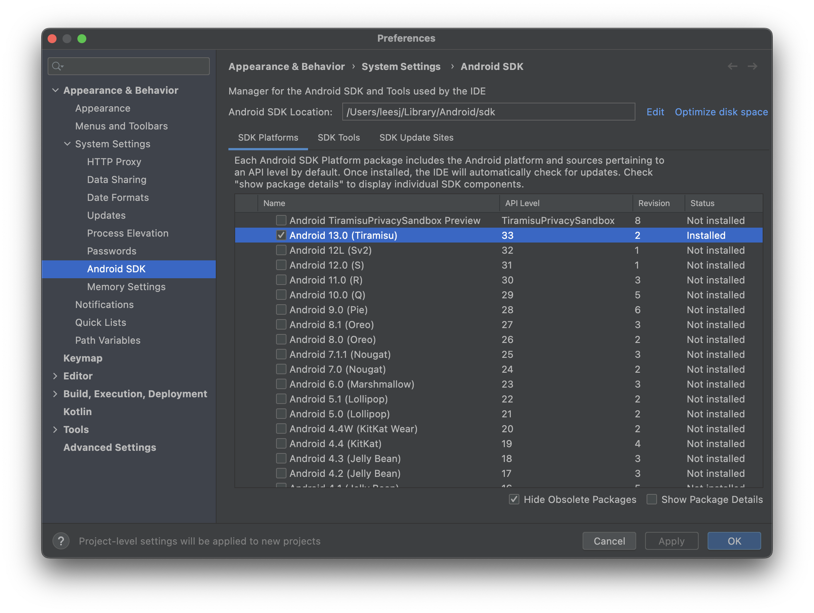
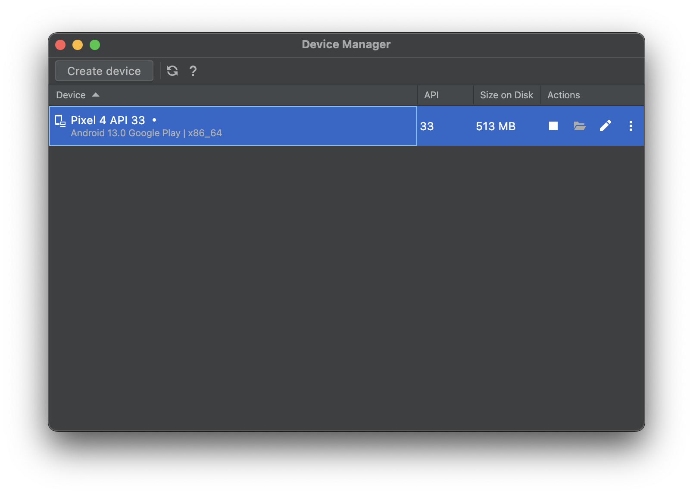
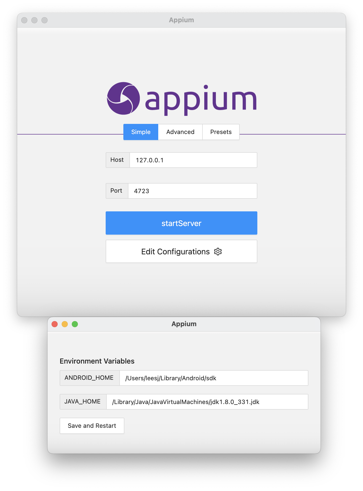
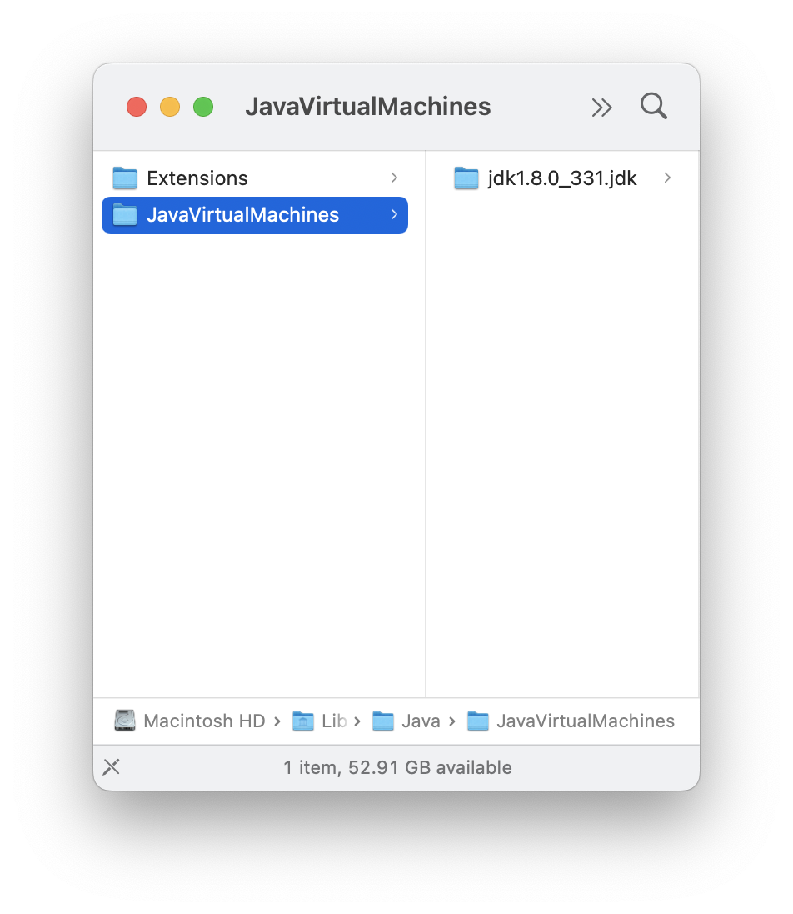
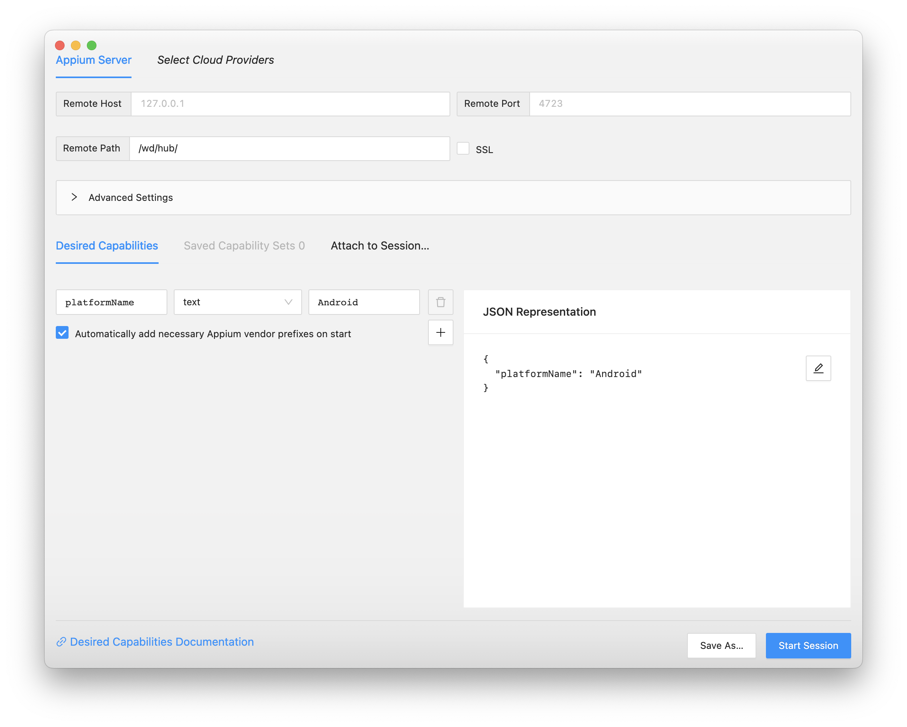
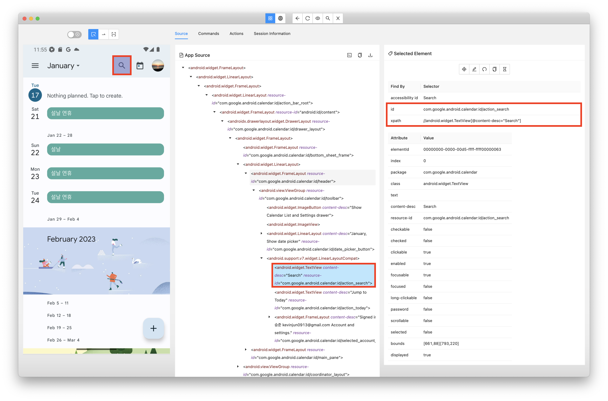

# 0. 들어가며
임의의 애플리케이션에 내가 원하는 동작을 컴퓨터가 자동으로 시행하게 해보아야겠다고 생각했다. 그 중 가장 구현하기 쉬운 방식을 찾아보아, Android Studio + Appium + Python을 사용하는 방식을 택하였다.

# 1. 준비사항
## 1-1. Android Studio
최신 버전의 [Android Studio](https://developer.android.com/studio)를 설치한다.
프로그램을 실행한 후, More Actions을 눌러 SDK Manager로 간다. Android 13.0 (Tiramisu)을 다운로드한다. 화면 상단에 보면 `Android SDK Location`이 있는데, 나중에 이 경로를 쓸 것이니 미리 복사해두기 바란다. 일반적으로 아래와 같을 것이다.
* Windows: `C:\Users\[사용자 이름]\AppData\Local\Android\SDK`
* Mac: `/Users/[사용자 이름]/Library/Android/sdk`이다.


다시 처음화면으로 돌아가 More Actions의 Virtual Device Manager로 간다. Create Device를 누르고 Pixel 4, Android 13.0 (Tiramisu)를 선택한다. 이후 플레이 버튼을 누르면 가상 안드로이드 디바이스가 실행된다.


## 1-2. Java SE 8
기존에 Java 8을 쓰는 사람은 건너뛰면 된다. [JDK, JRE 8 Oracle 페이지](https://www.oracle.com/kr/java/technologies/javase/javase8u211-later-archive-downloads.html)에 들어가서 JDK(Java Development Kit)와 JRE(Java Runtime Environment)를 설치한다.
Oracle 회원가입 및 로그인을 해야 하므로, 귀찮은 사람들을 위해 아래에 Oracle 서버의 direct download 링크를 넣어두겠다.

[JDK 8 Windows](https://javadl.oracle.com/webapps/download/GetFile/1.8.0_331-b09/165374ff4ea84ef0bbd821706e29b123/windows-i586/jdk-8u331-windows-x64.exe)

[JDK 8 Mac](https://javadl.oracle.com/webapps/download/GetFile/1.8.0_331-b09/165374ff4ea84ef0bbd821706e29b123/unix-i586/jdk-8u331-macosx-x64.dmg)

[JRE 8 Windows](https://javadl.oracle.com/webapps/download/AutoDL?BundleId=246264_165374ff4ea84ef0bbd821706e29b123)

[JRE 8 Mac](https://javadl.oracle.com/webapps/download/AutoDL?BundleId=246255_165374ff4ea84ef0bbd821706e29b123)

## 1-3. Appium Server GUI
[Appium Server GUI](https://github.com/appium/appium-desktop/releases/tag/v1.22.3-4)를 설치한 뒤 실행한다. Host는 `127.0.0.1`로, Port는 `4723`로 설정한다. Edit Configurations를 누르면 환경 변수를 설정하는 창이 뜬다.

ANDROID_HOME에는 앞에서 복사했던 `Android SDK Location`를 넣어준다. JAVA_HOME에는 설치한 JDK의 경로를 넣어준다. 일반적으로는 아래와 같다.
* Windows: `C:\Program Files\Java\jdk-[버전명]`
* Mac: `/Library/Java/JavaVirtualMachines/jdk[버전명].jdk`
Mac의 경우, Finder > Go > Go To Folder로 가서 `/Library/Java/JavaVirtualMachines/`을 입력하면 jdk 폴더가 나올 것이다.

다 끝났으면 startServer를 누른다.

## 1-4. Appium Inspector
[Appium Insepctor](https://github.com/appium/appium-inspector/releases)를 설치한 뒤 실행한다.

Remote Host가 `127.0.0.1`, Remote Port가 `4723`인지 확인한다. Remote Path는 `/wd/hub/`로 설정한다.

Desired Capabilities에 [`platformName`, `text`, `Android`]를 추가한다. (추가하지 않을 시 작동이 안 된다.)

다 끝났으면 Start Session을 누른다.

## 1-5. Python
기본적으로 Python 3와 IDE(PyCharm, VS Code 등)가 설치되어 있어야 한다. 또 모듈을 설치하기 위해 pip도 있어야 한다.

[Python 3](https://www.python.org/downloads/)

[VS Code](https://code.visualstudio.com/download)

[pip](https://pip.pypa.io/en/stable/installation/)

Terminal 혹은 Command Prompt에 아래를 입력한다.
* `pip install Appium-Python-Client` : Appium의 파이썬 클라이언트를 설치한다.
* `pip install selenium` : selenium의 여러 함수(By 등)을 사용하기 위해 설치한다.

# 2. 코드 작성 방법
Appium은 selenium의 웹 크롤링과 유사한 방식으로 작동된다. 가령, Google Calendar 앱 내에서 검색 버튼을 클릭하고 싶다고 해보자.


우선 Android Studio에서 구동하고 있는 가상 안드로이드에서 Google Calendar에 들어간다. 이후 Appium Inspector의 새로고침 버튼(Refresh Source And Screenshot)을 누른다. 그러면 Appium Inspector에 현재 휴대폰 화면이 뜰 것이다.

Select Elements 툴로 검색 버튼을 누르면, 그것에 해당하는 element를 아래 사진에서와 같이 보여준다.

이때 필요한 정보는 `id` 혹은 `xpath`이다. 이것을 이용하면 파이썬 코드를 작성하여 자동화할 수 있다.

```python
from appium import webdriver
from selenium.webdriver.common.by import By

desired_capabilities = {
    "platformName": "Android",
    "platformVersion": "13",
    "deviceName": "Android Emulator",
}

driver = webdriver.Remote("http://127.0.0.1:4723/wd/hub", desired_capabilities)
driver.find_element(By.ID, "com.google.android.calendar:id/action_search").click()
```


```toc
```