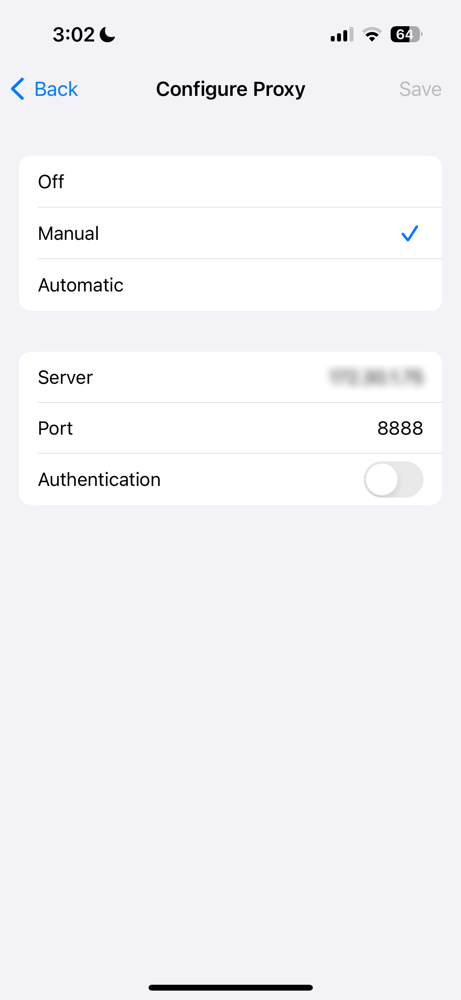
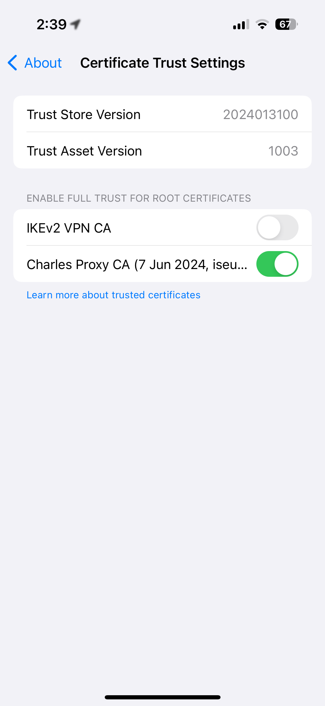
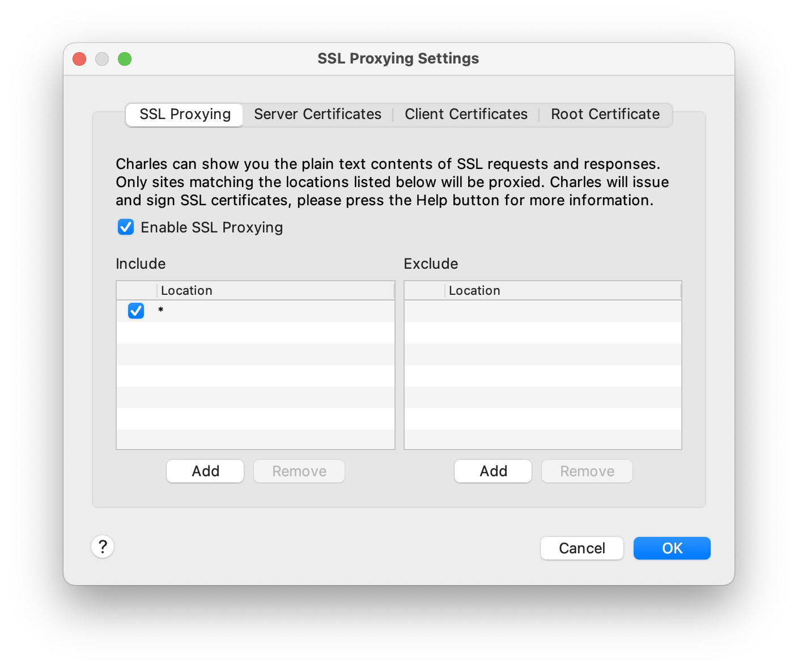
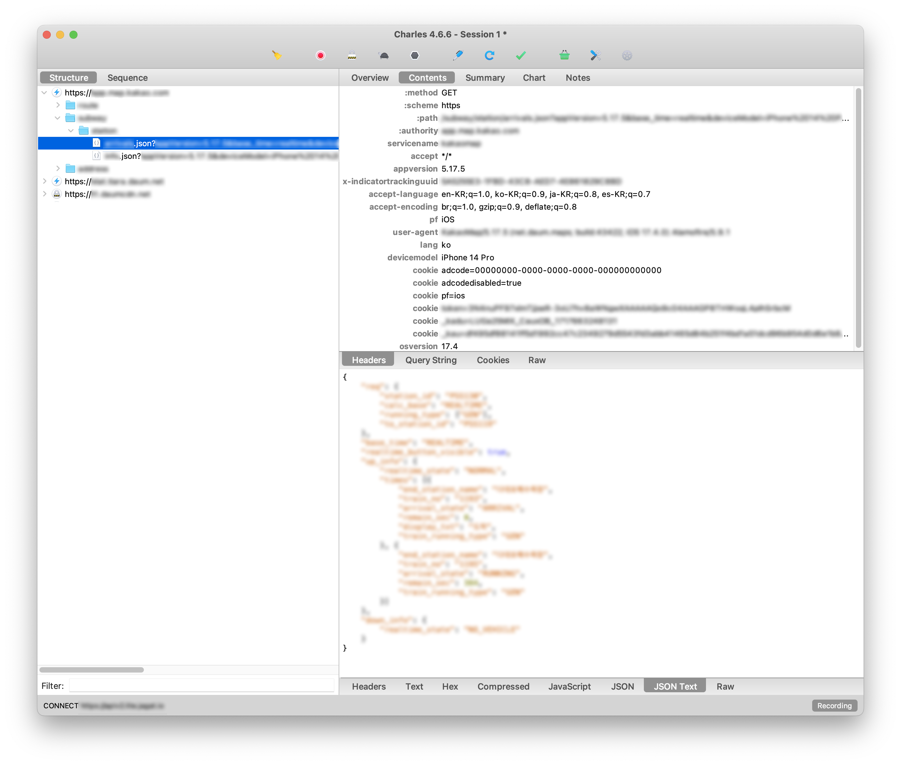

# 0. 들어가며
iOS 앱들을 보다 보면 어떤 앱에서 어떤 네트워크 요청을 주고 받는지 궁금할 때가 있다. 이럴 때, Charles Proxy라는 네트워크 스니핑(sniffing) 도구를 활용하면 간단하게 확인할 수 있다.

# 1. 준비사항
## 1-1. Charles Proxy 설치
컴퓨터에 최신 버전의 [Charles Proxy](https://www.charlesproxy.com/download/)를 설치한다. 30일 무료 평가판을 사용할 수 있으며, 이후에는 &#36;50을 지불하고 사용해야 한다. 또 평가판 기간에는 세션 당 30분의 시간 제한이 있다.

## 1-2. iPhone 와이파이 설정 변경
컴퓨터와 동일한 Wi-Fi 네트워크에 연결된 iPhone을 준비한다. iPhone의 설정에 들어가 `Wi-Fi > 해당 네트워크 옆 🛈`을 누르고 맨 밑으로 내리면 `Configure Proxy`(`프록시 구성`)이 있을 것이다. `Manual`로 바꿔주고 Server는 컴퓨터의 IP 주소, Port는 `8888`로 설정한다. 컴퓨터의 IP 주소를 알아내는 방법은 다음과 같다.
* Windows: `Command Prompt`를 열고 `ipconfig`를 입력하면 나오는 IPv4 주소
* Mac: `System Preferences > Wi-Fi`에 들어가 해당 네트워크 옆 `Details`를 누르면 나오는 IP 주소



## 1-4. SSL 인증서 설치
iPhone의 Safari에서 [SSL 인증서](https://chls.pro/ssl)를 다운로드하여 설치한다. 이후 iPhone의 설정에 들어가 아래 경로에서 Charles Proxy의 인증서를 활성화한다.
* 영문: `General > About > Certificate Trust Settings > Enable Full Trust for Root Certificates`
* 한글: `일반 > 정보 > 인증서 신뢰 설정 > 루트 인증서 전체 신뢰 활성화`



# 2. Charles 실행 및 설정
## 2-1. SSL Proxying 설정
Charles를 실행하고 `Proxy > SSL Proxying Settings`에 들어가서 `Enable SSL Proxying`을 체크한다. 이후 `Add`를 눌러 `Host`에 `*`를 입력한다. 이렇게 하면 모든 도메인으로 들어오는 SSL 트래픽을 Charles가 스니핑할 수 있다.



## 2-2. 패킷 분석
이제 아래 사진과 같이 앱에서 특정 동작을 수행하면 발생하는 JSON Request의 내용을 볼 수 있다. 이러한 네트워크 트래킹은 외부에 공개 시 문제의 소지가 발생할 가능성이 크므로, 대부분의 정보를 블러 처리하고 올리는 점 양해 바란다. 이처럼 상업적으로 운용되는 앱에 대해서 네트워크 패킷 분석은 개인적인 용도로만 사용하는 것이 바람직하다.



```toc
```