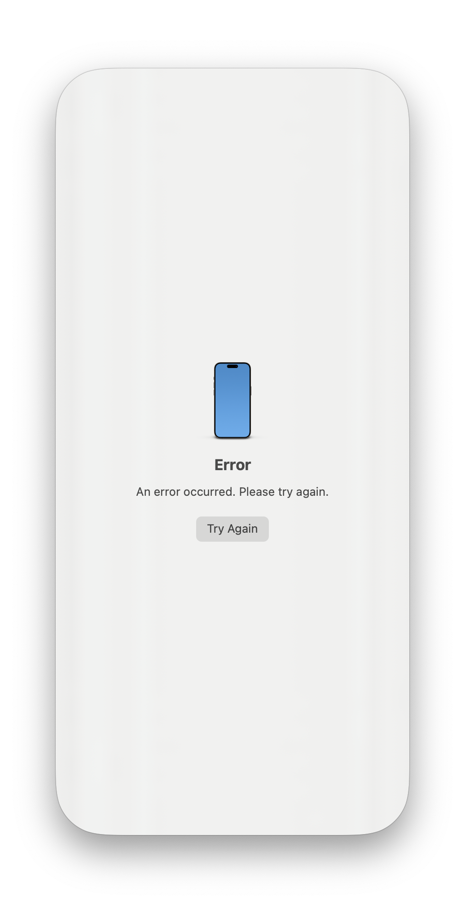
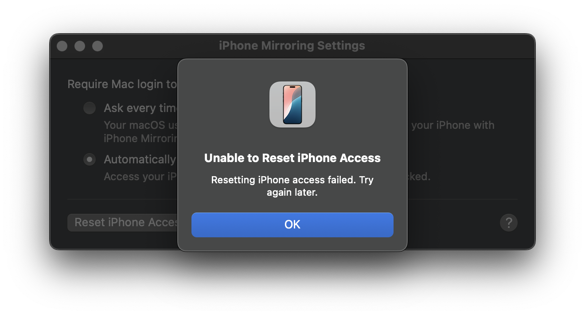

# 1. 무슨 현상인가?
iOS 18 / MacOS 15에 새로 도입된 'iPhone Mirroring'이 갑자기 어느 순간부터 아이폰에서 작동되지 않았다. 아래 사진과 같이 Mac에서 iPhone Mirroing을 시도하면 **"An error occurred. Please try again."**라는 메세지가 뜨며 `Try Again`을 아무리 눌러도 동일한 창이 뜬다.


`iPhone Mirroring > Settings > Reset iPhone Access`를 해봐도 **"Unable to Reset iPhone Access"**가 뜨면서 실패한다.


일반적인 다른 버그가 발생했을 때와 마찬가지로 먼저 시도해본 조치는
* Mac에서 iPhone Mirroring 재실행
* WiFi, Bluetooth 껐다 켜기
* Mac, iPhone 재부팅

이었다. 그럼에도 불구하고 이 현상을 해결하지 못하였다. 그래서 필자와 동일한 현상을 겪고 있는 사람이 없는지 검색해보았다.

# 2. 공론화
국내 커뮤니티에서는 [맥쓰사의 이 글](https://cafe.naver.com/inmacbook/2716116)을 제외하면 아직까지 보고된 바가 거의 없으며, Reddit, Apple Support, MacRumors 등 해외 포럼에서 일부 보고되었다.

[Reddit의 이 글](https://www.reddit.com/r/MacOS/comments/1fig94k/macos_15_iphone_mirroring_not_working/)의 댓글을 읽어보면 자신도 동일한 현상을 겪고 있다고 호소하는 사람도 있었고, [Reddit의 다른 글](https://www.reddit.com/r/MacOS/comments/1fictxd/iphone_mirroring_not_working/)에서는 200회(...) 정도 앱을 재실행하니 해결되었다고 하는 사람도 있었다.

# 3. 해결 방안
아래의 체크리스트를 순서대로 읽어보면서 해결 방안을 찾아보자.

## 3-1. 요구 사항 확인
[Apple의 공식 문서](https://support.apple.com/ko-kr/120421)를 다시 한번 읽어보며 iPhone Mirroring을 사용하기 위한 전제 조건을 만족했는지 확인해보자.
* 컴퓨터가 Apple Silicon이 탑재된 Mac 또는 Apple T2 보안 칩이 탑재된 Mac이며 macOS Sequoia 15 및 이후 버전을 사용하고 있습니다.
* iPhone이 iOS 18 및 이후 버전을 사용하고 있습니다.
* iPhone과 Mac이 이중 인증을 사용하는 동일한 Apple 계정에 로그인되어 있습니다.
* iPhone과 Mac에 Bluetooth 및 Wi-Fi가 켜져 있습니다.
* iPhone이 잠겨 있고 Mac 근처에 있습니다. 충전 중이거나 스탠바이를 사용 중이어도 됩니다.
* iPhone이 셀룰러 연결을 공유하고 있지 않습니다(개인용 핫스팟을 사용하고 있지 않음).
* Mac이 인터넷 연결을 공유하고 있지 않으며 AirPlay 또는 Sidecar를 사용하고 있지 않습니다.

## 3-2. VPN / DNS 등 네트워크 설정 확인
우선 필자의 경우에는 해당되지 않았지만 Mac, iPhone, 내지는 WiFi 라우터 측에서 VPN을 설정하지 않았는지 확인해볼 필요가 있다. VPN을 사용하고 있다면 VPN을 끄고 다시 시도해보자. 또 DNS를 수동으로 설정하고 있거나, 프록시 세팅을 해놓은 게 있다면 이를 해제하고 다시 시도해보자. 특히 [MacRumors의 이 글](https://forums.macrumors.com/threads/iphone-mirroring-not-working.2436525/)의 댓글에서는 Cloudflare사의 DNS 대신 ISP DNS를 사용하니 해결되었다는 사례가 있다.

## 3-3. iPhone을 맞게 선택했는지 확인
또 복수의 iPhone을 사용하는 경우, Mac의 `System Preferences > Desktop & Dock > Widgets`에서 사용할 iPhone이 맞게 선택되었는지 확인한다.

## 3-4. 기본적인 조치들
**1**에서 언급한 아래 세 가지를 반복적으로 시도해보자.
* Mac에서 iPhone Mirroring 재실행
* WiFi, Bluetooth 껐다 켜기
* Mac, iPhone 재부팅

## 3-5. iPhone에서 Mac 권한 삭제
iPhone 설정에서 `General > AirPlay & Continuity > iPhone Mirroring`으로 들어가서 Mac의 권한을 삭제한 뒤 다시 시도해보자.

## 3-6. Apple 계정 로그아웃 후 재로그인
Mac과 iPhone 모두에서 **Apple 계정을 로그아웃하고 다시 로그인**하는 방법이 필자에게는 유효하게 작용하였다. (이때 Mac에서 로그아웃할 때는 `Apple menu > Log Out`이 아니라 `System Preferences > Apple Account > Sign Out`을 해야 한다.) 이후 Apple 계정에 다시 로그인한 뒤, 두 기기를 모두 재시작한다.

## 3-7. Terminal을 이용하여 iPhone ID 삭제
그럼에도 안 된다면 Terminal을 이용하여 Continuity에 등록된 iPhone ID를 삭제하는 방법이 있다. 이 방법은 [Reddit의 이 글](https://www.reddit.com/r/MacOSBeta/comments/1f55455/potential_fix_for_iphone_mirroring_not_working_on/)에서 소개되었다.

1. Terminal에 `defaults export com.apple.ScreenContinuity ~/Desktop/ScreenContinuityDefaults.plist`을 입력하여 `ScreenContinuityDefaults.plist`을 임시로 Desktop에 백업한다.
2. Terminal에 `defaults delete com.apple.ScreenContinuity onenessPairedDeviceID`를 입력하여 Continuity에 등록된 iPhone ID(`onenessPairedDeviceID`)를 삭제한다.
3. Mac을 재시작한 뒤 iPhone Mirroring 앱을 다시 켠다.
4. 혹시나 문제가 발생하면 `defaults import com.apple.ScreenContinuity ~/Desktop/ScreenContinuityDefaults.plist`를 입력하여 원래대로 돌려놓는다.

## 3-8. 초기화
최후의 방안은 (당연하게도) Mac과 iPhone을 백업한 후 모두 초기화하는 것이다. 필자의 경우에는 그 전에 문제가 해결되었기에 여기까지 오지는 않았다. 사실 백업-초기화-복원을 하는 일련의 과정은 꽤나 골치 아픈 일이기 때문에, 위에서 언급한 방법들을 **반복적으로** 시도해본 뒤 정 안 되면 초기화하는 것이 좋다. 필자의 경우에도 Apple 계정 재로그인 이후, 재부팅과 iPhone Mirroring 앱 재실행을 **여러 번 반복**한 뒤에야 문제가 해결되었다.

## 4. 맺으며
Apple의 OS가 날이 갈수록 불안정해지고 있다는 느낌을 점점 받는다. 특히 iOS 14~15 정도부터 간헐적으로 버그들이 나타나더니 17과 18에서는 하루에 버그가 아예 나타나지 않는 날이 없을 정도로 그 정점을 찍고 있다. 이번 iPhone Mirroring 먹통 현상도 그 중 하나로, 이 현상을 겪는 유저들이 많진 않은 것으로 보이지만 해당 현상이 나타나는 유저들에게는 상당한 짜증을 안겨준다. Apple의 OS 엔지니어들이 이 글을 읽지는 않겠지만, 정식 버전을 릴리즈하기 전에 베타에서 모든 문제들을 해결하고 배포해달라는 것을 당부하고 싶다.

```toc
```