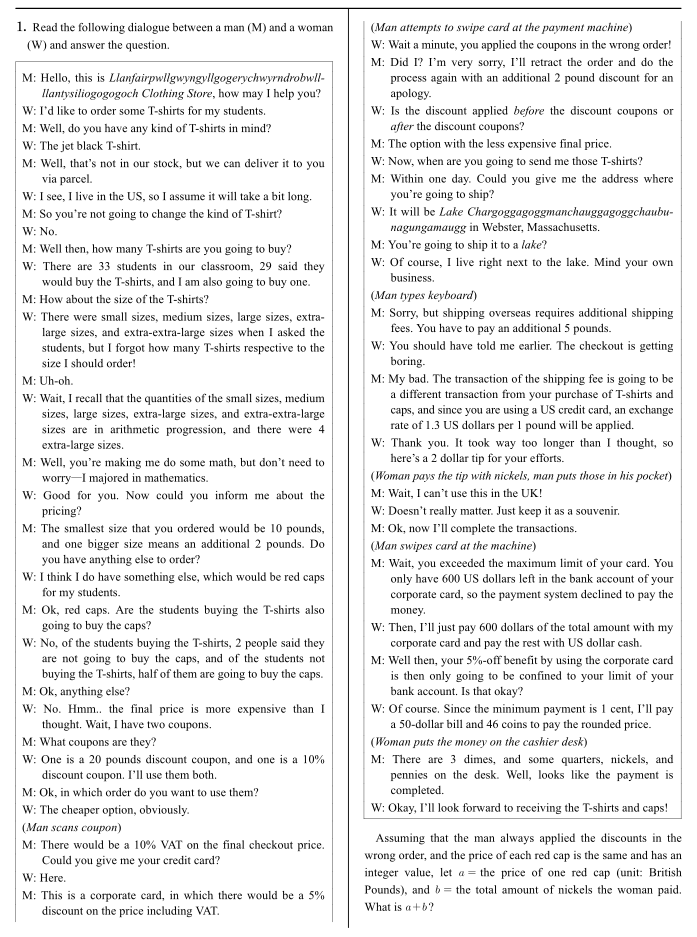

# 문제


# 정답
52

# 해설
$29$ students and the teacher are going to buy the T-shirts, so the total number of people buying the T-shirts is $30$.
Let $a_{1}$ as the quantity of small-sized T-shirts, $a_{2}$ as the quantity of medium-sized T-shirts, $a_{3}$ as the quantity of large-sized T-shirts, $a_{4}$ as the quantity of extra-large-sized T-shirts, and $a_{5}$ as the quantity of extra-extra-large-sized T-shirts.
Since $a_{1},\:a_{2},\:a_{3},\:a_{4},\:a_{5}$ are in arithmetic progression and $\displaystyle\sum_{k=1}^{5}{a_k}=30$, the arithmetic mean would be $a_{3}=\displaystyle\frac{30}{5}=6$.
Since $a_{4}=4$, the common difference would be $d=-2$.
Also, according to the passage, the small-sized T-shirt costs £10 and a bigger size means an additional £2.
Based on this information, the following table can be made:

|      Size      |  S  |  M |  L | XL | 2XL | Total |
|:--------------:|:---:|:--:|:--:|:--:|:---:|:-----:|
|    Quantity    |  10 |  8 |  6 |  4 |  2  |   30  |
| Price per unit |  10 | 12 | 14 | 16 |  18 |   -   |
| Total Price(£) | 100 | 96 | 84 | 64 |  26 |  380  |

The number of students buying the red cap is $27$ (of the $29$ students buying the T-shirts) $ +\,2$ (of the $4$ students not buying the T-shirts) $=29$.
Since the woman says she's buying the red caps for her *students*, it can be inferred that the woman is a teacher and she is not going to buy the red cap.
Therefore, the total number of people buying the red cap is $29$.
According to the question, the price of the red cap is set as $a$ (an unknown value).
Thus, the total price of the T-shirts and the red caps is £$(380+29a)$.

Although applying the 10%-off coupon before the £20 discount coupon is cheaper, the question presumes that the man repeatedly applied the discounts in the wrong order.
Thus, the £20 discount coupon was applied prior to the 10%-off coupon.
The same mechanism applies to the £2 apology discount—it was applied before the two coupons.
Therefore, the price after applying the two coupons and an additional discount would be £$\{(380+29a-2-20)\times 0.9\}=$£$(26.1a+322.2)$.

The next step would be to apply the 10% VAT, which makes the total price £$(28.71a+354.42)$.
This is equivalent to \$$(28.71a+354.42)\times1.3=(37.323a+460.746)$.
Only \$$600$ can be paid with the corporate card, which is \$$(600 \div 0.95)=\dfrac{12000}{19}$ before the 5%-off benefit of the corporate card.
Therefore, the rest of the payment, which is \$$\left(37.323a+460.746-\dfrac{12000}{19}\right)$, was paid with US dollar cash.

The next step before deducting the quantity of each type of coin is to add the extra money the woman should pay.
First of all, the \$2 tip that the woman gave to the man should not be included in the coin quantity deduction process.
This is because the man said the dimes, quarters, nickels, and the pennies are *on the desk*, while the \$2 tip went to the *man's pocket*.
Next, the woman paid an extra £5 for the shipping fee, which is equivalent to \$$5\times1.3=6.5$.
If we add this to the money that the woman paid in cash, the total would be \$$\left(37.323a+467.246-\dfrac{12000}{19} \right)$.
The woman then paid a \$50 bill and $3$ dimes, which is a total of \$50.3.
Therefore, using $46-3=43$ coins that include quarters, nickels, and pennies, the woman paid \$$\left(37.323a+416.946-\dfrac{12000}{19}\right)$.
Let this value as $n$.
We will now find the maximum and minimum values of $n$ in order to specify $a$.
If the woman paid $41$ quarters, $1$ nickle, and $1$ penny, $n=41\times0.25+1\times0.05+1\times0.01=10.31$.
If the woman paid $1$ quarter, $1$ nickle, and $41$ pennies, $n=1\times0.25+1\times0.05+41\times0.01=0.71$.
$$
0.71 \leq 37.323a+416.946-\dfrac{12000}{19} \leq 10.31
$$

$$
5.769 \lessapprox a \lessapprox 6.026
$$

Since $a$ is an integer, $a=6$.
If we substitute $a=6$ in $n$, $n=37.323\times6+416.946-\dfrac{12000}{19}\approx9.305$.
Since the minimum payment is $1$ cent, the woman has to pay \$$9.31$ to pay the rounded price.
Let $x_{1}=$ the number of quarters the woman paid, $x_{2}=$ the number of nickles the woman paid (excluding the nickles she paid as a tip), and $x_{3}=$ the number of pennies the woman paid.
We now have to solve the following indeterminate equation, given that $x_{1},\: x_{2},\:x_{3} \in \mathbb{N}$.
$$
\begin{cases} x_{1}+x_{2}+x_{3}=43 \qquad\qquad\qquad\quad\,\cdots\: \textrm{(A)} \\ 0.25x_{1}+0.05x_{2}+0.01x_{3}=9.31\quad \cdots\: \textrm{(B)} \end{cases}
$$

Multiplying $100$ at (B) gives

$$
\begin{cases} x_{1}+x_{2}+x_{3}=43\qquad\quad\cdots\:\textrm{(A)} \\ 25x_{1}+5x_{2}+x_{3}=931\quad\cdots\:\textrm{(C)} \end{cases}
$$

Subtracting (A) and (C) leads to
$$
24x_{1}+4x_{2}=888
$$

$$
6x_{1}+x_{2}=222
$$

(ⅰ) If $x_{1} \geq 37$, then $6x_{1}+x_{2}\geq 222$;
    This does not satisfy $x_{2}\geq 1$.

(ⅱ) If $x_{1}=36$, then $x_{2}=222-6\times36=6$, and  $x_{3}=43-36-6=1$.

(ⅲ) If $x_{1}\leq 35$, then $x_{2}=222-6x_{1}$, which leads to $x_{1}+x_{2}=222-5x_{1}\geq 47$.
    However, since $x_{3}\geq 1$, this does not satisfy $x_{1}+x_{2}+x_{3}=43$.

Therefore, the woman paid $36$ quarters, $6$ nickels, and $1$ penny for the total price.
Since she also tipped \$2 with $2\div 0.05=40$ nickels, $b$ (the total amount of nickels the woman paid) $=6+40=46$

$\therefore \: a+b=6+46=\boxed{\bm{52}}$

```toc
```