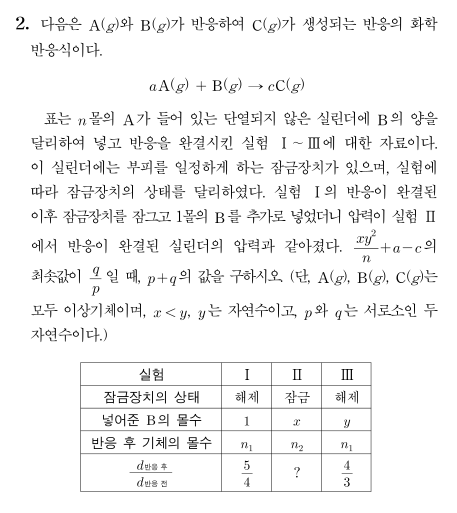

## 문제


## 정답
82

## 해설
실험 I과 III의 피스톤이 단열되어 있지 않으므로 등온, 피스톤의 고정장치가 풀려있으므로 등압이기 때문에 $ V \propto n$이 성립한다. 따라서 질량이 일정한 실린더 내에서 $d = \dfrac{w}{V} \propto \dfrac{1}{n}$이다. 즉 $n_{\textrm{반응 전}}\::\:n_{\textrm{반응 후}}$가 실험 I에서는 $5\::\:4$, 실험 III에서는 $4\::\:3$이다. 여기에서 $a>c$라는 것을 알 수 있는데, 연속적으로 B를 첨가하는 실험으로 해석한다면 실린더 속 기체의 몰수는 점점 감소하다가 A가 모두 반응한 이후 다시 증가한다고 볼 수 있으므로 실험 I에서 모두 반응한 물질은 B라는 것을 알 수 있다.

### Step 1. 실험 I 식을 세워보자.

$$
(n+1)\::\:(n-a+c)=5\::\:4
$$

$$
n+1=5l,\;n-a+c=4l
$$

$$
5l-1-a+c=4l
$$

$$
a-c=l-1
$$

$a$와 $c$가 정수이므로, $l$도 정수이다.

또 $n \geq 0$이므로, $5l \geq 1$; 즉 $l$은 자연수이다.

$c=a-l+1$이므로, 반응비는 $a:1:(a-l+1)$이다.


### Step 2. 실험 III에서, 모두 반응한 물질을 B라고 해보자.

$$
(5l-1+y)\::\:(5l-1-ly+y)=4\::\:3
$$

$$
15l-3+3y=20l-4-4ly+4y
$$

$$
5l-1-4ly+y=0
$$

$$
y-1=(4y-5)l
$$

$$
l=\dfrac{y-1}{4y-5}=\dfrac{\frac{1}{4}}{4y-5}+\dfrac{1}{4}
$$


$y \geq 2$이므로, $\dfrac{1}{4} \leq l \leq \dfrac{1}{3}$이다. 이는 $l$이 자연수라는 조건에 위배된다. 따라서 실험 III에서 모두 반응한 물질은 A이다.

### Step 3. 실험 III 식을 세워보자.

문제 조건에서 실험 I의 반응 후 전체 기체의 양($n-a+c=4l$)은 실험 III의 반응 후 전체 기체의 양과 동일하므로 실험 III의 반응 후 총 몰수는 $4l$, 반응 전 총 몰수는 $4l \times \dfrac{4}{3} = \dfrac{16}{3}l$이다.

$$
5l-1+y=\dfrac{16}{3}l
$$

$$
y=\dfrac{1}{3}l+1
$$

$$
y-\dfrac{5l-1}{a}+\dfrac{(5l-1)(a-l+1)}{a}=4l
$$

(4)에 (3)을 대입하면

$$
\dfrac{l}{3}+1-\dfrac{5l-1}{a}+\dfrac{(5l-1)(a-l+1)}{a}=4l\qquad
$$

$$
\dfrac{l}{3}+1+\dfrac{(5l-1)(a-l)}{a}=4l
$$

양변에 $a$를 곱하면

$$
\dfrac{al}{3}+a+5al-5l^{2}-a+l=4al
$$

$$
\dfrac{4}{3}al-5l^{2}+l=0
$$

$l \neq 0$이므로

$$
\dfrac{4}{3}a=5l-1
$$

$$
a=\dfrac{3}{4}(5l-1)
$$

여기에서 $5l-1$이 4의 배수가 되어야 하므로 $l=1,\:5,\:9,\:\cdots$


### Step 4. $(a,\:l,\:y,\:c,\:n)$의 순서쌍을 찾아보자.

이 중 $y$가 정수인 순서쌍은 $l=9,\:21,\;33, \:\cdots$일 때다.

문제에서 $\dfrac{xy^{2}}{n}+a-c$의 최솟값을 구하라고 했는데, $\dfrac{xy^{2}}{n}+a-c$의 값은

(i) $a=33,\:l=9,\:y=4,\:c=25,\:n=44$일 때 $\dfrac{16}{44}x_{1}+8\:\:(0<x_{1}<4)$

(ii) $a=78,\:l=21,\:y=21,\:c=58,\:n=104$일 때 $\dfrac{64}{104}x_{2}+20\:\:(0<x_{2}<8)$

설사 $x_{1} \xrightarrow{} 4-$, $x_{2} \xrightarrow{} 0+$라 하더라도 (i)에서는 $\dfrac{16}{11}+8<10$이고 (ii)의 값은 20이므로 (i)은 항상 (ii)보다 작다. 즉 $l$이 커질수록 $\dfrac{xy^{2}}{n}+a-c$은 계속 커지기 때문에, $a=33,\;l=9,\;y=4,\;c=25,\;n=44$일 때 최소가 된다.

### Step 5. $x$를 구해보자.

I에서 반응 후 결과에 B(g) $1$몰을 첨가하면


(B 첨가 전 기체의 전체 몰수) : (B 첨가로 인한 반응 후 기체의 전체 몰수) = $36\::\:34$인데,
B를 첨가하기 전 실린더의 고정장치를 잠갔고, 실린더 속 온도는 일정하기 때문에 $P\propto\dfrac{1}{V}$가 성립한다.

즉 (B 첨가 전 실린더의 압력) = $1\textrm{atm}$, (B 첨가로 인한 반응 후 실린더의 압력) = $\dfrac{17}{18}\textrm{atm}$이다. $\dfrac{17}{18}\textrm{atm}$이 실험 II에서의 반응 후 실린더 압력이므로, $PV\propto n$에 의해 (실험 II에서의 반응 후 기체의 전체 몰수) = $44\times\dfrac{17}{18}=\dfrac{374}{9}$이다.

### Step 6. 실험 II 식을 세워보자.

(i) $x\geq\dfrac{4}{3}$


$$
x-\dfrac{4}{3}+\dfrac{100}{3}=\dfrac{374}{9}
$$

$$
x=\dfrac{86}{9}
$$

$x>y=4$이므로 조건에 위배된다.

(ii) $x<\dfrac{4}{3}$

$$
44-33x+25x=\dfrac{374}{9}
$$

$$
8x=\dfrac{22}{9}
$$

$$
x=\dfrac{11}{36}
$$

$x<y=4$이므로 조건을 만족한다.

$\therefore \dfrac{x y^{2}}{n}+a-c$의 최솟값은 $\dfrac{11}{36}\times 4^{2}\times\dfrac{1}{44}\times(33-25)=\dfrac{1}{9}+8=\dfrac{73}{9}$

$p=9,\;q=73\;\longrightarrow\;p+q=\boxed{\bm{82}}$

```toc
```