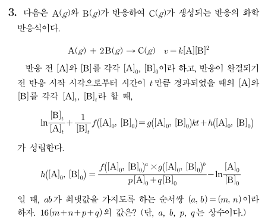

## 문제


---

## 해설
경과된 시간이 $t$ 일 때 $x$ 만큼 반응하였다고 한다면 $[\mathrm{A}]_{t}=[\mathrm{A}]_{0}-x$, $[\mathrm{B}]_{t}=[\mathrm{B}]_{0}-2x$ 이다.

$v=\dfrac{\mathrm{d}x}{\mathrm{d}t}=k[\mathrm{A}]_{t}[\mathrm{B}]_{t}^{\;2}= k\left([\mathrm{A}]_{0}-x\right)\left([\mathrm{B}]_{0}-2x\right)^{2}$

양변에 $\mathrm{d}t$ 를 곱하면 $\dfrac{\mathrm{d}x}{\left([\mathrm{A}]_{0}-x\right)\left([\mathrm{B}]_{0}-2x\right)^{2}}=k\:\mathrm{d}t$

$k$ 를 구하기 위해서는 양변을 적분하여 $\displaystyle\int_{\,0}^{\,t}{k\:\mathrm{d}t}=kt$ 를 도출해야 하므로, 좌변의 적분을 용이하게 하기 위해

$\dfrac{\mathrm{d}x}{\left([\mathrm{A}]_{0}-x\right)\left([\mathrm{B}]_{0}-2x\right)^{2}}=\dfrac{p}{[\mathrm{A}]_{0}-x}+\dfrac{4px+q}{\left([\mathrm{B}]_{0}-2x\right)^{2}}$ 형태로 변환하자.

이는 $\dfrac{p}{[\mathrm{A}]_0-x }$를 우선 잡은 후에, 분모를 $\left([\mathrm{A}]_{0}-x\right)\left([\mathrm{B}]_{0}-2x\right)^{2}$ 로 통분하였을 때 분자의 이차항이 $0$ 이 되도록 $\dfrac{4px+q}{([\mathrm{B}]_0-2x)^{2}}$ 의 일차항을 잡은 것이다.

양변을 통분한 후 양변에 $\left([\mathrm{A}]_{0}-x\right)\left([\mathrm{B}]_{0}-2x\right)^{2}$ 를 곱하면

$\begin{aligned}1&=p\left([\mathrm{B}]_{0}-2x\right)^{2}+\left(4px+q\right)\left([\mathrm{A}]_{0}-x\right) \\ &=[\mathrm{B}]_{0}^{\;2}\,p-4[\mathrm{B}]_{0}\,px+4px^{2}+4[\mathrm{A}]_{0}\,px-4px^{2}+[\mathrm{A}]_{0}\,q-q \end{aligned}$

$\left(4[\mathrm{A}]_{0}\,p-4[\mathrm{B}]_{0}\,p-q\right)x+\left([\mathrm{B}]_{0}^{\;2}\,p+[\mathrm{A}]_{0}\,q-1\right)=0$

$4\left([\mathrm{A}]_{0}-b\right)p=q$, $[\mathrm{B}]_{0}\,p+[\mathrm{A}]_{0}\,q=1$

$[\mathrm{B}]_{0}^{\;2}\,p+4[\mathrm{A}]_{0}\left([\mathrm{A}]_{0}-[\mathrm{B}]_{0}\right)p=1$

$\left(4[\mathrm{A}]_{0}^{\;2}-4[\mathrm{A}]_{0}[\mathrm{B}]_{0}+4[\mathrm{B}]_{0}^{\;2}\right)p=1$

$p=\dfrac{1}{\left(2[\mathrm{A}]_{0}-[\mathrm{B}]_{0}\right)^{2}}$, $q=\dfrac{4([\mathrm{A}]_{0}-[\mathrm{B}]_{0})}{\left(2[\mathrm{A}]_{0}-[\mathrm{B}]_{0}\right)^{2}}$

$\therefore \dfrac{1}{\left([\mathrm{A}]_{0}-x\right)\left([\mathrm{B}]_{0}-2x\right)^{2}}=\dfrac{1}{\left(2[\mathrm{A}]_{0}-[\mathrm{B}]_{0}\right)^{2}}\times\left\{\dfrac{1}{[\mathrm{A}]_{0}-x}+\dfrac{4x+4\left([\mathrm{A}]_{0}-[\mathrm{B}]_{0}\right)}{\left([\mathrm{B}]_{0}-2x\right)^{2}}\right\}$ 이므로,

$\left[\dfrac{1}{\left(2[\mathrm{A}]_{0}-[\mathrm{B}]_{0}\right)^{2}}\times\left\{\dfrac{1}{[\mathrm{A}]_{0}-x}+\dfrac{4x+4\left([\mathrm{A}]_{0}-[\mathrm{B}]_{0}\right)}{\left([\mathrm{B}]_{0}-2x\right)^{2}}\right\}\right]\mathrm{d}x=k\,\mathrm{d}t$

$\begin{aligned}\displaystyle\int_{\,0}^{\,t}{k\:\mathrm{d}t}&=\displaystyle\int_{\,0}^{\,x}{\dfrac{\mathrm{d}x}{\left([\mathrm{A}]_{0}-x\right)\left([\mathrm{B}]_{0}-2x\right)^{2}}}=\dfrac{1}{\left(2[\mathrm{A}]_{0}-[\mathrm{B}]_{0}\right)^{2}}\times\displaystyle\int_{\,0}^{\,x}{\left\{\dfrac{1}{[\mathrm{A}]_{0}-x}+\dfrac{4x+4\left([\mathrm{A}]_{0}-[\mathrm{B}]_{0}\right)}{\left([\mathrm{B}]_{0}-2x\right)^{2}}\right\}\mathrm{d}x } \\ &=\dfrac{1}{\left(2[\mathrm{A}]_{0}-[\mathrm{B}]_{0}\right)^{2}}\times\left\{\displaystyle\int_{\,0}^{\,x}{\dfrac{1}{[\mathrm{A}]_{0}-x}\:\mathrm{d}x}+\displaystyle\int_{\,0}^{\,x}{\dfrac{4x}{\left([\mathrm{B}]_{0}-2x\right)^{2}}\:\mathrm{d}x+\displaystyle\int_{\,0}^{\,x}{\dfrac{4\left([\mathrm{A}]_{0}-[\mathrm{B}]_{0}\right)}{\left([\mathrm{B}]_{0}-2x\right)^{2}}\:\mathrm{d}x}}\right\}\end{aligned}$

$\displaystyle\int_{\,0}^{\,x}{\dfrac{4x}{\left([\mathrm{B}]_{0}-2x\right)^{2}}\:\mathrm{d}x }$ 를 구하기 위해 치환적분하자.

앞에서 $[\mathrm{B}]_{0}-2x=[\mathrm{B}]_{t}$ 였다. $x=\dfrac{[\mathrm{B}]_{0}-[\mathrm{B}]_{t}}{2}$, $-2\:\mathrm{d}x=\mathrm{d}[\mathrm{B}]_{t}$ 이므로,

$\displaystyle\int_{\,0}^{\,x}{\dfrac{4x}{[\mathrm{B}]_{t}^{\;2}}\:\mathrm{d}x}=\displaystyle\int_{\,[\mathrm{B}]_{0}}^{\,[\mathrm{B}]_{0}-2x}{-\dfrac{[\mathrm{B}]_{0}-[\mathrm{B}]_{t}}{\left([\mathrm{B}]_{t}\right)^{2}}\:\mathrm{d}[\mathrm{B}]_{t}}=\displaystyle\int_{\,[\mathrm{B}]_{0}-2x}^{\,[\mathrm{B}]_{0}}{\left(\dfrac{[\mathrm{B}]_{0}}{[\mathrm{B}]_{t}^{\;2}}-\dfrac{1}{[\mathrm{B}]_{t}}\right)\mathrm{d}[\mathrm{B}]_{t}}=\left[\,-\dfrac{[\mathrm{B}]_{0}}{[\mathrm{B}]_{t}}-\ln [\mathrm{B}]_{t}\,\right]_{[\mathrm{B}]_{0}-2x}^{[\mathrm{B}]_{0}}$

$\begin{aligned}\displaystyle\int_{\,0}^{\,t}{k\:\mathrm{d}t} &=\dfrac{1}{\left(2[\mathrm{A}]_{0}-[\mathrm{B}]_{0}\right)^{2}}\times\left\{\bigg[-\ln\left([\mathrm{A}]_{0}-x\right)\bigg]_{0}^{x}+\left[\,-\dfrac{[\mathrm{B}]_{0}}{[\mathrm{B}]_{t}}-\ln[\mathrm{B}]_{t}\,\right]_{[\mathrm{B}]_{0}-2x}^{[\mathrm{B}]_{0}}+\left[\,\dfrac{4\left([\mathrm{A}]_{0}-[\mathrm{B}]_{0}\right)}{2\left([\mathrm{B}]_{0}-2x\right)}\,\right]_{0}^{x}\right\} \\ &=\dfrac{1}{\left(2[\mathrm{A}]_{0}-[\mathrm{B}]_{0}\right)^{2}}\times\left[\bigg\{\!-\ln\left([\mathrm{A}]_{0}-x\right)+\ln[\mathrm{A}]_{0}\bigg\}+\left\{-1+\dfrac{[\mathrm{B}]_{0}}{[\mathrm{B}]_{0}-2x}+\ln\dfrac{[\mathrm{B}]_{0}-2x}{[\mathrm{B}]_{0}}\right\}+\left\{\dfrac{2\left([\mathrm{A}]_{0}-[\mathrm{B}]_{0}\right)}{[\mathrm{B}]_{0}-2x }-\dfrac{2\left([\mathrm{A}]_{0}-[\mathrm{B}]_{0}\right)}{[\mathrm{B}]_{0}}\right\}\right] \\ &=\dfrac{1}{\left(2[\mathrm{A}]_{0}-[\mathrm{B}]_{0}\right)^{2}}\times\left\{\dfrac{2[\mathrm{A}]_{0}-[\mathrm{B}]_{0}}{[\mathrm{B}]_{0}-2x }-\dfrac{2[\mathrm{A}]_{0}-[\mathrm{B}]_{0}}{[\mathrm{B}]_{0}}+\ln\dfrac{[\mathrm{A}]_{0}\left([\mathrm{B}]_{0}-2x\right)}{[\mathrm{B}]_{0}\left([\mathrm{A}]_{0}-x\right)}\right\} \\ &=\dfrac{1}{\left(2[\mathrm{A}]_{0}-[\mathrm{B}]_{0}\right)^{2}}\times\left\{\dfrac{2\left(2[\mathrm{A}]_{0}-[\mathrm{B}]_{0}\right)x}{[\mathrm{B}]_{0}\left([\mathrm{B}]_{0}-2x\right)}+\ln\dfrac{[\mathrm{A}]_{0}\left([\mathrm{B}]_{0}-2x\right)}{[\mathrm{B}]_{0}\left([\mathrm{A}]_{0}-x\right)}\right\} \\ &=\dfrac{1}{\left(2[\mathrm{A}]_{0}-[\mathrm{B}]_{0}\right)^{2}}\times\left\{\dfrac{2\left(2[\mathrm{A}]_{0}-[\mathrm{B}]_{0}\right)x}{[\mathrm{B}]_{0}[\mathrm{B}]_{t}}+\ln\dfrac{[\mathrm{A}]_{0}[\mathrm{B}]_{t}}{[\mathrm{B}]_{0}[\mathrm{A}]_{t}}\right\} \\&=\dfrac{[\mathrm{B}]_{0}-[\mathrm{B}]_{t}}{\left(2[\mathrm{A}]_{0}-[\mathrm{B}]_{0}\right)[\mathrm{B}]_{0}[\mathrm{B}]_{t}}+\dfrac{1}{\left(2[\mathrm{A}]_{0}-[\mathrm{B}]_{0}\right)^{2}}\ln\dfrac{[\mathrm{A}]_{0}[\mathrm{B}]_{t}}{[\mathrm{B}]_{0}[\mathrm{A}]_{t}} \quad (\because 2x=[\mathrm{B}]_{0}-[\mathrm{B}]_{t}) \\ &= \dfrac{1}{\left(2[\mathrm{A}]_{0}-[\mathrm{B}]_{0}\right)}\times\left(\dfrac{1}{[\mathrm{B}]_{t}}-\dfrac{1}{[\mathrm{B}]_{0}}\right)+\dfrac{1}{\left(2[\mathrm{A}]_{0}-[\mathrm{B}]_{0}\right)^{2}}\ln\dfrac{[\mathrm{A}]_{0}[\mathrm{B}]_{t}}{[\mathrm{B}]_{0}[\mathrm{A}]_{t}}\end{aligned}$

$\left(2[\mathrm{A}]_{0}-[\mathrm{B}]_{0}\right)^{2}\times kt=\left(2[\mathrm{A}]_{0}-[\mathrm{B}]_{0}\right)\times\left(\dfrac{1}{[\mathrm{B}]_{t}}-\dfrac{1}{[\mathrm{B}]_{0}}\right)+\ln\dfrac{[\mathrm{A}]_{0}[\mathrm{B}]_{t}}{[\mathrm{B}]_{0}[\mathrm{A}]_{t}}$

$\ln\dfrac{[\mathrm{B}]_{t}}{[\mathrm{A}]_{t}}+\dfrac{2[\mathrm{A}]_{0}-[\mathrm{B}]_{0}}{[\mathrm{B}]_{t}}=\left(2[\mathrm{A}]_{0}-[\mathrm{B}]_{0}\right)^{2}\times kt+\dfrac{2[\mathrm{A}]_{0}-[\mathrm{B}]_{0}}{[\mathrm{B}]_{0}}-\ln\dfrac{[\mathrm{A}]_{0}}{[\mathrm{B}]_{0}}$

$\begin{cases} \begin{aligned} \,f\left([\mathrm{A}]_{0}, [\mathrm{B}]_{0}\right)&=2[\mathrm{A}]_{0}-[\mathrm{B}]_{0} \\[1ex] g\left([\mathrm{A}]_{0}, [\mathrm{B}]_{0}\right)&=\left(2[\mathrm{A}]_{0}-[\mathrm{B}]_{0}\right)^{2} \\[1ex] h\left([\mathrm{A}]_{0}, [\mathrm{B}]_{0}\right)&=\dfrac{2[\mathrm{A}]_{0}-[\mathrm{B}]_{0}}{[\mathrm{B}]_{0}}-\ln\dfrac{[\mathrm{A}]_{0}}{[\mathrm{B}]_{0}} \end{aligned} \end{cases}$

$\dfrac{f\left([\mathrm{A}]_{0}, [\mathrm{B}]_{0}\right)^{a}\times g\left([\mathrm{A}]_{0}, [\mathrm{B}]_{0}\right)^{b}}{p[\mathrm{A}]_{0}+q[\mathrm{B}]_{0}}=\dfrac{2[\mathrm{A}]_{0}-[\mathrm{B}]_{0}}{[\mathrm{B}]_{0}}$

$\dfrac{\left(2[\mathrm{A}]_{0}-[\mathrm{B}]_{0}\right)^{a+2b}}{p[\mathrm{A}]_{0}+q[\mathrm{B}]_{0}}=\dfrac{2[\mathrm{A}]_{0}-[\mathrm{B}]_{0}}{[\mathrm{B}]_{0}}$ 이 항등식이 되기 위해서는 $a+2b=1$, $p=0$, $q=1$ 이 되어야 한다.

$a+2b=1$ 을 만족하는 실수 $a$, $b$ 에 대하여 $ab$ 의 최댓값을 구하기 위해, $ab=\alpha$ 라고 두자.

우리가 구하고자 하는 것은 ‘최댓값’이므로, $\alpha \geq 0$ 일 때를 우선적으로 검토할 것이다.
만약 $\alpha>0$ 일 때 $a+2b=1$ 을 만족하는 실수 $a$, $b$ 가 없다면, $\alpha<0$ 일 때를 검토하면 된다.

$b=-\dfrac{1}{2}a+\dfrac{1}{2}$ 와 $b=\dfrac{\alpha}{a}(\alpha >0)$ 를 $ab$ 좌표평면에 나타낼 때, 두 그래프는 오직 제$1$사분면에서만 만난다.

이때 $a\geq 0$, $b\geq 0$ 이며, 산술-기하평균을 사용하면 $a+2b=1\geq 2\sqrt{2ab}$

$\sqrt{2ab}\leq\dfrac{1}{2}$; $ab\leq\dfrac{1}{8}$

$ab=\dfrac{1}{8}$ 일 때 $a=2b$ 이므로, $a=\dfrac{1}{2}=m$, $b=\dfrac{1}{4}=n$

$\therefore m+n+p+q\leq\dfrac{1}{2}+\dfrac{1}{4}+0+1=\dfrac{7}{4}=M$

$16M=28$</body></html>

---

## 정답
28

```toc
```
