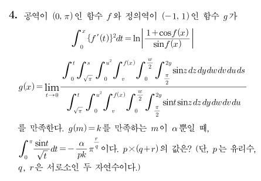

## 문제


- - -

## 해설
### Step 1. $f(x)$ 구하기
<br>

$\displaystyle\int_{\,0}^{\,x} \left\{ f^{\prime}(t) \right\}^{2}dt=\ln \big\lvert\, 1+\cos f(x) \,\big\rvert-\ln \big\lvert\, \sin f(x) \,\big\rvert \;\cdots \textrm{(가)}$

$\left\{ f^{\prime}(x) \right\}^{2}=\left\{ \dfrac{-\sin f(x)}{1+\cos f(x)} - \dfrac{\cos f(x)}{\sin f(x)} \right\} \cdot f^{\prime}(x)$

$\begin{aligned} f^{\prime}(x)&= -\dfrac{\sin^{2} f(x) + \cos f(x) + \cos^{2} f(x)}{\left\{1+\cos f(x) \right\} \cdot \sin f(x)} \\ &= -\dfrac{1 + \cos f(x)}{\left\{1+\cos f(x) \right\} \cdot \sin f(x)} \\ &= -\dfrac{1}{\sin f(x)}\end{aligned}$

$f^{\prime}(x) \cdot \sin f(x) = -1$

$\cos f(x) = x + C$ ($C$ 는 적분상수)

(가)에 $x=0$ 을 대입하면 $0=\ln \bigg\lvert\,\dfrac{1+\cos f(0)}{\sin f(0)}\,\bigg\rvert$

$\therefore 1 + \cos f(0) = \sin f(0)$ 또는 $1 + \cos f(0) = -\sin f(0)$

어느 경우든 간에 $\left\{1 + \cos f(0)\right\}^{2}=\left\{\sin f(0) \right\}^{2}$ 이다.

그러므로 $\left\{\sin f(0) \right\}^{2} + \left\{\cos f(0) \right\}^{2} = 1$ 에서

$\left\{1 + \cos f(0) \right\}^{2} + \left\{\cos f(0) \right\}^{2} = 1$

$2 \left\{\cos f(0) \right\}^{2} + 2 \cos f(0) = 0$

$\cos f(0) = 0$ 또는 $\cos f(0) = -1$

문제 조건에서 $f$ 의 공역이 $(0, \pi)$ 이기 때문에, $\cos f(0) \neq -1$ 이다. 따라서 $\cos f(0) = 0$ 이고, $C=0$ 이다.

$\therefore \cos f(x) = x$

<br>

### Step 2. $g(x)$ 구하기

$\displaystyle\int _{\,\frac{\pi}{2}}^{\,2y}\sin z \: \mathrm{d}z = \bigg[\,-\cos z \,\bigg]_{\frac{\pi}{2}}^{2y} = -\cos 2y$

$\displaystyle\int _{\,0}^{\,\frac{w}{2}}-\cos 2y \: \mathrm{d}y = \left[\,-\dfrac{1}{2}\sin 2y \,\right]_{0}^{\frac{w}{2}} = -\dfrac{1}{2} \sin w$

$\displaystyle\int _{\,v}^{\,f(x)}-\dfrac{1}{2} \sin w \: \mathrm{d}w = \left[\,\dfrac{1}{2}\cos w \,\right]_{v}^{f(x)} = \dfrac{1}{2} \left\{\cos f(x) - \cos v \right\}=\dfrac{1}{2} \left(x - \cos v \right)$

$\displaystyle\int _{\,0}^{\,u^2}\dfrac{1}{2} \left(x - \cos v \right) \mathrm{d}v = \left[\,\sin v - \dfrac{1}{2} xv\,\right]_{0}^{u^2}=\dfrac{1}{2} \left\{\sin(u^2) - xu^2\right\}$

$h(t)=\displaystyle\int _{\sqrt{\pi}} ^{\,t} \left\{\sin\left(u^2\right) - xu^2\right\}\mathrm{d}u$ 라 하자.

$h^{\prime}(t)=-x t^{2} + \sin \left(t ^2 \right)$

$\begin{aligned} \displaystyle\int_{\,0}^{\,t} h(s) \: \mathrm{d}s &= \bigg[\,sh(s)\,\bigg]_{0}^{t} - \displaystyle\int_{\,0}^{\,t} s h^{\prime}(s) \: \mathrm{d}s \\ &= th(t) - \displaystyle\int_{\,0}^{\,t}s \cdot \left\{ -xs^2 + \sin\left(s^2\right)\right\}\, \mathrm{d} s \end{aligned}$

$k=s^2$ 라 하면 $\mathrm{d} k = 2s\: \mathrm{d} s$

$\begin{aligned} \displaystyle\int_{\,0}^{\,t} h(s) \: \mathrm{d}s &= th(t) - \dfrac{1}{2}\displaystyle\int_{\,0}^{\,t^2}\left(-xk + \sin k \right)\, \mathrm{d}k  \\ &= th(t) - \dfrac{1}{2} \bigg[\,-\dfrac{x}{2}v^{2} - \cos v \,\bigg]_{0}^{t^2} \\ &= th(t) - \dfrac{1}{2} \left\{-\dfrac{x}{2} t^{4} - \cos \left( t^2 \right) + 1 \right\}\end{aligned}$

$\begin{aligned} g(x)&=\lim\limits_{t\rightarrow0}\dfrac{\dfrac{1}{2}\displaystyle\int_{\,0}^{\,t}{h(s) \: \mathrm{d} s}}{\dfrac{1}{2}\,h(t) \sin t} \\ &= \lim\limits_{t\rightarrow0}\dfrac{th(t) - \dfrac{1}{2} \left\{-\dfrac{x}{2} t^4 - \cos \left(t^2 \right) + 1 \right\}}{\sin t \cdot h(t)} \\ &= \lim\limits_{t\rightarrow0}\dfrac{t}{\sin t} + \dfrac{1}{4} \lim\limits_{t\rightarrow0}\dfrac{xt^4}{\sin t \cdot h(t)}-\dfrac{1}{2} \lim\limits_{t\rightarrow0}\dfrac{1-\cos\left(t^2\right)}{\sin t \cdot h(t)} \\ &= 1 + \dfrac{1}{4} \lim\limits_{t \rightarrow 0}\dfrac{(x-1) t^3}{h(t)}\end{aligned}$

(ⅰ) $x$가 $h(0) = 0$ 을 만족할 때

$i(t) = (x-1)t^3$ 로 두면, $i^{\prime}(t) = 3(x-1)t^2$ 이므로

$\lim\limits_{t \rightarrow 0} \dfrac{i(t)}{h(t)} = \lim\limits_{t \rightarrow 0}\cfrac{\frac{i(t)-i(0)}{t}}{\frac{h(t)-h(0)}{t}}= \lim\limits_{t \rightarrow 0} \dfrac{i^{\prime}(t)}{h^{\prime}(t)} = \lim\limits_{t \rightarrow 0} \dfrac{3(x-1)t^2}{-x t^{2} + \sin \left(t ^2 \right)}=-3$

$g(x)=1-\dfrac{3}{4}=\dfrac{1}{4}$

$l=\sqrt{t}$ 라 하면 $\mathrm{d} t = 2l \: \mathrm{d} l$ 이므로,

$\displaystyle\int_{\,0}^{\,\pi}\dfrac{\sin t}{\sqrt t} \: \mathrm{d} t = \displaystyle\int_{\,0}^{\,\sqrt{\pi}}\dfrac{\sin \left(l^2 \right)}{l} \cdot 2l \: \mathrm{d} l = 2 \displaystyle\int_{\,0}^{\,\sqrt{\pi}}\sin \left(l^2 \right)\mathrm{d} l$

$\begin{aligned} h(0)&=\displaystyle\int _{\sqrt{\pi}} ^{\,0} \left\{\sin\left(l^2\right) - xl^2\right\}\mathrm{d}l \\ &= \bigg[ -\dfrac{x}{3} l^{3} \, \bigg] _{0}^{\sqrt{\pi}} - 2 \displaystyle\int_{\,0}^{\,\sqrt{\pi}} \sin \left( l^2 \right) \mathrm{d} l = 0\end{aligned}$

$\displaystyle\int_{\,0}^{\,\sqrt{\pi}} \sin \left( l^2 \right) \mathrm{d} l = - \dfrac{x}{6} \pi \sqrt{\pi}$

$\displaystyle\int_{\,0}^{\,\sqrt{\pi}} \sin \left( l^2 \right) \mathrm{d} l$ 은 상수이므로, 위 식을 만족시키는 $x$ 는 $\alpha$ 로 유일하다.

(다시 말해 $g(m)=\dfrac{1}{4}$ 을 만족하는 $m$ 은 $\alpha = -\dfrac{6\int_{0}^{\sqrt{\pi}} \sin \left( l^2 \right) \mathrm{d} l}{\pi \sqrt{\pi}}$ 로 유일하다.)

따라서 $f(\alpha)=\dfrac{1}{4}=k$ 이고, $\displaystyle\int_{\,0}^{\,\pi}\dfrac{\sin t}{\sqrt t} \: \mathrm{d} t = -\dfrac{x}{3} \pi^{\frac{3}{2}}$

$pk=3$ 이므로 $p=12$, $q=2$, $r=3$

$\therefore p \times (q + r) = 60$

<br>

(ⅱ) $x$가 $h(0) \neq 0$ 을 만족할 때

$\lim\limits_{t \rightarrow 0}\dfrac{(x-1) t^3}{h(t)} = 0$ 이므로 $g(x)=1$ 이다. 그런데 앞에서 $h(0) = 0$ 을 만족하는 $x$ 는 단 한 개임을 보였으므로, $h(0) \neq 0$ 을 만족하는 $x$ 는 무수히 많다. 고로 $g(m)=1$ 을 만족하는 $m$ 이 $\alpha$ 뿐인 경우는 없다.


- - -

## 정답
60
- - -

## 여담
2017학년도 9월 평가원 가형 21번과 유사하게 생겼지만 풀이의 방향성은 사뭇 다르다. 괴랄하게 생긴 중적분 형태의 식과는 달리, 풀이는 생각보다 깔끔하다는 것을 알 수 있을 것이다.


```toc
```
