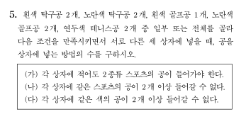

## 문제


- - -

## 해설
노란색 탁구공을 $a_1$, 흰색 탁구공을 $a_2$, 노란색 골프공을 $b_1$, 흰색 골프공을 $b_2$, 연두색 테니스공을 $c$ 라 하자. 전체 $9$ 개의 공 중 상자에 넣을 공의 개수를 $n$ 이라 하면, 조건 (가)에 의해 $n \geq 6$ 이다.

### (ⅰ) $n=6$ 일 때

#### (ⅰ)-ㄱ. $c$ 가 $0$ 개일 때
각 상자에 들어갈 공의 조합을 순서쌍으로 나타내보자.
$\left(a_1, b_2\right)$, $\left(a_2, b_1\right)$, $\left(a_2, b_1\right)$ 의 경우만 존재하므로 이를 나열하는 경우는 $3$ 가지이다.

#### (ⅰ)-ㄴ. $c$ 가 $1$ 개일 때
먼저 $c$ 가 들어갈 상자를 결정하는 경우의 수는 $3$ 이다.

- $\left(c, a_1\right)$ 일 때: 남은 두 상자가 $\left(a_1, b_2\right)$, $\left(a_2, b_1\right)$ 일 때 $2$ 가지, $\left(a_2, b_1\right)$, $\left(a_2, b_1\right)$ 일 때 $1$ 가지

- $\left(c, a_2\right)$ 일 때: 남은 두 상자가 $\left(a_1, b_2\right)$, $\left(a_2, b_1\right)$ 일 때 $2$ 가지

- $\left(c, b_1\right)$ 일 때: 남은 두 상자가 $\left(a_1, b_2\right)$, $\left(a_2, b_1\right)$ 일 때 $2$ 가지

- $\left(c, b_2\right)$ 일 때: 남은 두 상자가 $\left(a_2, b_1\right)$, $\left(a_2, b_1\right)$ 일 때 $1$ 가지

따라서 $3 \times (2+1+2+2+1)=24$

#### (ⅰ)-ㄷ. $c$ 가 $2$ 개일 때
$(c, x)$, $(c, y)$, 그리고 $c$ 가 포함되지 않은 상자 하나로 이루어진다.

- $c$ 가 포함되지 않은 상자가 $\left(a_1, b_2\right)$ 일 때: $a_1$, $a_2$, $a_2$, $b_1$, $b_1$ 이 남으므로, $x$, $y$ 가 서로 다를 때 $_{3} \mathrm{C}_{2} \times 3! = 18$ 가지, $x$, $y$ 가 같을 때 $2 \times 3 = 6$ 가지가 존재한다. 따라서 $18+6=24$

- $c$ 가 포함되지 않은 상자가 $\left(a_2, b_1\right)$ 일 때: $a_1$, $a_1$, $a_2$, $b_1$, $b_2$ 가 남으므로, $x$, $y$ 가 서로 다를 때 $_{4} \mathrm{C}_{2} \times 3! = 36$ 가지,
$x$, $y$ 가 같을 때 $1 \times 3 = 3$ 가지가 존재한다. 따라서 $36+3=39$

따라서 $24+39=63$

$\therefore 3+24+63=90$

<br>

### (ⅱ) $n=7$ 일 때
#### (ⅱ)-ㄱ. $c$ 가 $0$ 개일 때
가능한 경우가 없다.

#### (ⅱ)-ㄴ. $c$ 가 $1$ 개일 때
$c$ 가 포함된 상자는 공 $3$ 개, 나머지 상자들은 공 $2$ 개가 들어간다.

먼저 $c$ 가 들어갈 상자를 결정하는 경우의 수는 $3$ 이다.

- $(c, a_1, b_2)$ 일 때: $(a_2, b_1)$, $(a_2, b_1)$ 일 때 $1$ 가지

- $(c, a_2, b_1)$ 일 때: $(a_1, b_2)$, $(a_2, b_1)$ 일 때 $2$ 가지

따라서 $3 \times (1+2)=9$

#### (ⅱ)-ㄷ. $c$ 가 $2$ 개일 때
$(c, x, y)$, $(c, z)$, 그리고 $c$ 가 포함되지 않은 상자 하나로 이루어진다.

- $(x, y)=(a_1, b_2)$, $c$ 가 포함되지 않은 상자가 $(a_2, b_1)$ 일 때: $a_1$, $a_2$, $b_1$ 이 남으므로, 가능한 $z$ 는 $3$ 가지

- $(x, y)=(a_2, b_1)$, $c$ 가 포함되지 않은 상자가 $(a_1, b_2)$ 일 때: $a_1$, $a_2$, $b_1$ 이 남으므로, 가능한 $z$ 는 $3$ 가지

- $(x, y)=(a_2, b_1)$, $c$ 가 포함되지 않은 상자가 $(a_2, b_1)$ 일 때: $a_1$, $a_1$, $b_2$ 가 남으므로, 가능한 $z$ 는 $2$ 가지

따라서 $3! \times (3+3+2) = 6 \times 8 = 48$

$\therefore 9 + 48 = 57$

<br>

### (ⅲ) $n=8$ 일 때
#### (ⅲ)-ㄱ. $c$ 가 $0$ 개일 때
가능한 경우가 없다.

#### (ⅲ)-ㄴ. $c$ 가 $1$ 개일 때
가능한 경우가 없다.

#### (ⅲ)-ㄷ. $c$ 가 $2$ 개일 때
먼저 $c$ 가 들어갈 상자를 결정하는 경우의 수는 $_3 \mathrm{C}_2 = 3$ 이다.

- $c$ 가 포함되지 않은 상자가 $(a_1, b_2)$ 일 때: $a_1$, $a_2$, $a_2$, $b_1$, $b_1$ 이 남으므로, 남은 두 상자는 $(c, a_2, b_1)$, $(c, a_2, b_1)$ 일 때 $1$ 가지

- $c$ 가 포함되지 않은 상자가 $(a_2, b_1)$ 일 때: $a_1$, $a_1$, $a_2$, $b_1$, $b_2$ 가 남으므로, 남은 두 상자는 $(c, a_1, b_2)$, $(c, a_2, b_1)$ 일 때 $2$ 가지

따라서 $3 \times (1+2) = 9$

<br>

### (ⅳ) $n=9$ 일 때
가능한 경우가 없다.

<br>
$\therefore 90+57+9=156$

- - -

## 정답
156

```toc
```
