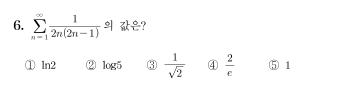

## 문제


- - -

## 해설
$\begin{aligned}\displaystyle \sum_{n=1}^{\infty}\dfrac{1}{2n(2n-1)} &= \displaystyle \sum_{n=1}^{\infty}\left(\dfrac{1}{2n-1} - \dfrac{1}{2n}\right) \\ &= \lim\limits_{n \rightarrow \infty}\left(\dfrac{1}{1}-\dfrac{1}{2}+\dfrac{1}{3}-\dfrac{1}{4}+\cdots+\dfrac{1}{2n-1}-\dfrac{1}{2n}\right) \\ &= \lim\limits_{n \rightarrow \infty}\left(\dfrac{1}{1}+\dfrac{1}{2}+\dfrac{1}{3}+\cdots+\dfrac{1}{2n}\right) -2 \lim\limits_{n \rightarrow \infty}\left(\dfrac{1}{2}+\dfrac{1}{4}+\dfrac{1}{6}+\cdots+\dfrac{1}{2n}\right) \\ &= \lim\limits_{n \rightarrow \infty}\left(\dfrac{1}{1}+\dfrac{1}{2}+\dfrac{1}{3}+\cdots+\dfrac{1}{2n}\right) - \lim\limits_{n \rightarrow \infty}\left(\dfrac{1}{1}+\dfrac{1}{2}+\dfrac{1}{3}+\cdots+\dfrac{1}{n}\right) \\ &= \lim\limits_{n \rightarrow \infty}\left(\dfrac{1}{n+1}+\dfrac{1}{n+2}+\dfrac{1}{n+3}+\cdots+\dfrac{1}{2n}\right) \\ &= \lim\limits _{n \rightarrow \infty} \displaystyle\sum_{k=1}^{n}\dfrac{1}{n+k} = \lim\limits _{n \rightarrow \infty} \displaystyle\sum_{k=1}^{n}\cfrac{\frac{1}{n}}{1+\frac{k}{n}} \\ &= \displaystyle \int_{\,1}^{\,2}\dfrac{1}{x}\:\mathrm{d}x = \bigg[\ln x\bigg]_{1}^{2} = \ln 2\end{aligned}$

- - -

## 정답
1

## Comment
첫 발상을 해내는 데까지 다소 시간이 소요될 것으로 예상되지만, 문제 자체는 PASAT의 여느 다른 문제들(!)과 달리 아주 깔끔하다.

## History
* 최초 출제일: 2022.01.31.
* 해설 작성일: 2022.01.31.
* 웹 업로드일: 2023.04.15.

```toc
```
