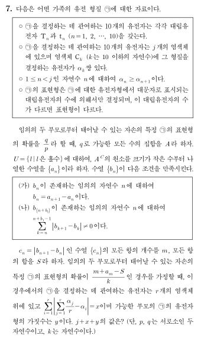

## 문제


- - -

## 해설

## Step 1. 가능한 연관의 경우의 수를 구하자.
총 $10$ 개의 유전자를 $j$ 개의 염색체 그룹으로 배분하기 위해서는 자연수의 분할 알고리즘이 필요하다.
자연수의 분할을 구현하는 방식은 여러 가지가 있겠지만, 가장 대표적인 접근방법은 다음의 재귀 호출을 사용한 방법일 것으로 생각된다.

```python
def partitions(n, I=1):
    yield [n]
    for i in range(I, n//2 + 1):
        for p in partitions(n - i, i):
            yield [i] + p

alleles = 10
linkages_list = list(partitions(alleles))
```

혹은 `itertools`를 이용해도 된다.
```python
from itertools import combinations_with_replacement as comb

alleles = 10
linkages_list = [list(x) for s in range(1, alleles + 1) for x in comb(range(1, alleles + 1), s) if sum(x) == alleles]
```

`linkages_list`를 출력해보면 아래와 같다.
> `[10], [1, 9], [2, 8], [3, 7], [4, 6], [5, 5], [1, 1, 8], [1, 2, 7],` (...생략...) `, [1, 1, 1, 1, 1, 1, 1, 1, 2], [1, 1, 1, 1, 1, 1, 1, 1, 1, 1]]`

<br>

## Step 2. 집합 $A$를 구하자.
`linkages_list`의 각 원소를 `linkages`라고 하자. 우선 각 `linkages` 경우에서 나타날 수 있는 표현형에 무엇이 있는지를 구해야 한다. 그러기 위해서는 각각의 염색체에서 가능한 표현형에 무엇이 있는지를 구한 다음 더해야 한다.

형질을 결정하는 유전자가 $\alpha_k$쌍 존재하는 임의의 염색체 $C_k$에서 가능한 표현형의 수를 구해보자. 아버지의 상동염색체에 대문자 개수가 각각 $\epsilon_1$와 $\epsilon_2$, 어머니의 상동염색체에 대문자 개수가 각각 $\epsilon_3$과 $\epsilon_4$라고 해보자. 그렇다면 $\epsilon_n$ ($n=1$, $2$, $3$, $4$)의 범위는 $0\leq\epsilon_n\leq\alpha_k$일 것이다. 하나의 염색체에서 다인자 유전의 표현형 가짓수는 오로지 부모 상동염색체의 대문자 개수의 "차이"에 의해 결정된다. 아버지의 대문자 개수의 차이 $\left |\epsilon_1 - \epsilon_2 \right|$와 어머니의 대문자 개수의 차이 $\left |\epsilon_3 - \epsilon_4 \right|$를 크기 순서대로 나타낸 것을 $i$와 $j$라고 하면, 부모의 교배 시 발생하는 자녀의 표현형(대문자 개수)은 $\delta$, $\delta+i$, $\delta+j$, $\delta+i+j$의 네 가지가 될 것이다. ($\delta=\min(\epsilon_1, \epsilon_2) + \min(\epsilon_3, \epsilon_4)$)

* 이 부분이 직관적으로 이해되지 않는다면 이렇게 이해해보자. $\epsilon_1 \leq \epsilon_2$, $\epsilon_3 \leq \epsilon_4$라 해도 일반성을 잃지 않는다. $\delta$를 $\epsilon_1 + \epsilon_3$로 정의하면, 자녀의 표현형(대문자 개수)으로 가능한 것은 아래와 같다.
  * $\epsilon_1 + \epsilon_3 = \delta$
  * $\epsilon_2 + \epsilon_3 = \delta + (\epsilon_2 - \epsilon_1)$
  * $\epsilon_1 + \epsilon_4 = \delta + (\epsilon_4 - \epsilon_3)$
  * $\epsilon_2 + \epsilon_4 = \delta + (\epsilon_4 - \epsilon_3) + (\epsilon_2 - \epsilon_1)$

  이는 각각 $\delta$, $\delta+i$, $\delta+j$, $\delta+i+j$ 또는 $\delta$, $\delta+j$, $\delta+i$, $\delta+i+j$이다.


이 내용을 이제 코드로 구현시켜보자. 먼저 `linkages`의 각 원소 `capital` ($=\alpha_k$)에 대하여 시행하기를, $0 \leq$ `i` $\leq$ `capital`, $0 \leq$ `j`$\leq$ `i`에 대하여 `(i, j)`로 가능한 경우의 수의 집합을 구한다. (아래 `pc_list`는 possible capital list의 준말이다.)

```python
for linkages in linkages_list:
    pc_list = [[(i, j) for i in range(capital + 1) for j in range(i + 1)] for capital in linkages]
```

가령, `linkages`가 `[1, 4, 5]`인 경우 `pc_list`는 아래와 같다:
> `[[(0, 0), (1, 0), (1, 1)],`
>
> `[(0, 0), (1, 0), (1, 1), (2, 0), (2, 1), (2, 2), (3, 0), (3, 1), (3, 2), (3, 3), (4, 0), (4, 1), (4, 2), (4, 3), (4, 4)],`
>
> `[(0, 0), (1, 0), (1, 1), (2, 0), (2, 1), (2, 2), (3, 0), (3, 1), (3, 2), (3, 3), (4, 0), (4, 1), (4, 2), (4, 3), (4, 4), (5, 0), (5, 1), (5, 2), (5, 3), (5, 4), (5, 5)]]`

다음 과정은 `pc_list`의 각 원소 안에 있는 `(i, j)` 순서쌍을 `product` 함수로 묶어주고, 그 안에 있는 각각의 `poly_list` 안에 있는 각각의 `p`에 대하여 가능한 자녀의 표현형을 구한다. 단, $\delta$는 확률만 구하면 되기 때문에 더할 필요가 없으므로 고려하지 않았다.

```python
from itertools import product

for poly_list in product(*pc_list):
    poly_germ = [[p[0] + p[1], p[0], p[1], 0] for p in poly_list]
```

실제로 만들어지는 자녀의 표현형은 앞에서 구한 '각각의 염색체에서의 표현형'들의 합일 것이다. 따라서 `product` 함수를 한 번 더 써주면 된다.

```python
from itertools import product

child = [sum(x) for x in product(*poly_germ)]
```

다음 과정은 표현형 확률에 들어가는 분자를 구하는 것이다. 최대 표현형 개수는 `child`의 원소의 최댓값이기에, $0 \leq n \leq$ `max_capital` 인 정수 $n$에 대하여 `child`의 원소 중 $n$이 몇 개인지 센 후, 그것이 $2$로 나누어떨어지지 않을 때까지 $2$로 계속해서 나눠준다. 그 결과값을 `odd_exists` set (=집합 $A$)에 기록해둔다.

```python
capital_cnt = [child.count(n) for n in range(max(child) + 1)]
odd_exists = set()
for x in capital_cnt:
    if x != 0:
        while x % 2 == 0:
            x = x // 2
        odd_exists.add(x)
```

예컨대 `poly_list`가 `[(2, 2), (2, 0)]`라면 결과는 아래와 같을 것이다.
> `poly_germ = [[4, 2, 2, 0], [2, 2, 0, 0]]`
>
> `child = [6, 6, 4, 4, 4, 4, 2, 2, 4, 4, 2, 2, 2, 2, 0, 0]`
>
> `capital_cnt = [2, 0, 6, 0, 6, 0, 2]`
>
> `numerator = [1, 0, 3, 0, 3, 0, 1]`

마지막 과정은 집합 $A^C$의 원소들을 얻어내는 것이다. $U$는 무한집합이므로, 구간 $[n, \infty)$에 존재하는 자연수 모두가 집합 $A$의 원소로 불가능한 자연수 $n$을 구해야 한다. 표현형의 개수가 $1$인 경우에는 분자 $q$가 항상 $1$, 표현형의 개수가 $2$인 경우에는 $q$가 항상 $2$이므로 고려할 필요가 없고, 표현형의 개수가 $3$ 이상인 경우에는 다인자 유전에서는 표현형의 평균을 기준으로 항상 대칭을 이루므로 $\dfrac{q}{p} < \dfrac{1}{2}$이다. 분모의 최댓값은 $2^{10}=1024$이므로, 분자는 아무리 커봤자 $1023$을 넘지 못한다. 즉 $A^C$를 구할 때는 $1$과 $1023$ 사이의 홀수를 기준으로만 계산하면 되고, $n=1025$ 이상의 홀수는 무조건 $A^C$의 원소이다. `odd_total`은 따라서 `set(range(1, 1024, 2))`로 설정할 수가 있다.

```python
odd_total = set(range(1, 1024, 2))
odd_notexists = odd_total - odd_exists
```

지금까지의 과정을 전부 정리해보자.

```python
from itertools import combinations_with_replacement as comb
from itertools import product

linkages_list = [list(x) for s in range(1, alleles + 1) for x in comb(range(1, alleles + 1), s) if sum(x) == alleles]
odd_total = set(range(1, 1024, 2))
odd_exists = set()

for linkages in linkages_list:
    pc_list = [[(i, j) for i in range(capital + 1) for j in range(i + 1)] for capital in linkages]
    for poly_list in product(*pc_list):
        poly_germ = [[p[0] + p[1], p[0], p[1], 0] for p in poly_list]
        child = [sum(x) for x in product(*poly_germ)]
        capital_cnt = [child.count(n) for n in range(max(child) + 1)]
        for x in capital_cnt:
            if x != 0:
                while x % 2 == 0:
                    x = x // 2
                odd_exists.add(x)

odd_notexists = odd_total - odd_exists
```

출력값은 다음과 같다.
> {161, 173, 175, 181, 185, 207, 213, 225, 229, 243, 257, 259, 261, 267, 269, 283, 291, 295, 305, 309, 313, 315, 317, 327, 329, 335, 337, 347, 349, 351, 353, 355, 357, 359, 361, 363, 367, 369, 371, 381, 383, 387, 389, 391, 395, 401, 409, 411, 415, 417, 419, 421, 423, 425, 427, 431, 433, 437, 439, 443, 445, 447, 449, 453, 457, 459, 461, 467, 469, 471, 475, 477, 479, 481, 483, 487, 489, 493, 499, 503, 505, 511, 513, 515, 521, 523, 525, 527, 531, 533, 535, 537, 539, 541, 543, 545, 547, 551, 555, 557, 559, 565, 567, 569, 575, 579, 581, 583, 585, 587, 589, 591, 593, 597, 599, 601, 603, 607, 609, 611, 613, 615, 617, 619, 621, 625, 631, 633, 635, 639, 641, 643, 645, 647, 651, 653, 655, 657, 659, 661, 663, 665, 667, 669, 671, 673, 677, 679, 685, 687, 689, 691, 693, 695, 699, 701, 703, 705, 707, 709, 711, 713, 717, 719, 721, 723, 725, 727, 729, 731, 733, 737, 745, 747, 749, 751, 753, 755, 757, 759, 761, 763, 767, 769, 771, 773, 775, 781, 783, 785, 787, 789, 791, 795, 799, 801, 805, 807, 811, 813, 817, 819, 821, 823, 825, 827, 829, 831, 833, 835, 837, 839, 841, 843, 845, 847, 849, 851, 853, 855, 857, 859, 861, 865, 867, 869, 871, 873, 875, 877, 879, 881, 883, 885, 887, 889, 891, 893, 895, 899, 901, 903, 905, 907, 909, 911, 913, 915, 917, 919, 921, 923, 925, 927, 929, 931, 935, 937, 939, 941, 943, 945, 951, 953, 955, 957, 959, 961, 963, 965, 967, 971, 973, 977, 979, 981, 983, 985, 987, 989, 991, 993, 995, 997, 999}


따라서 $\left\{a_n\right\} = 161$, $173$, $175$, $181$, $185$, $207$, $213$, $225$, $229$, $243$, $257$, $259$, $\cdots$


<br>

## Step 2. $\left\{b_n\right\},\; \left\{c_n\right\}$을 구해보자.
역시 아래의 간단한 코드를 사용한다.

```python
a_n = list(odd_total - odd_exists)
b_n = []
c_n = []

for i in range(0, len(a_n) - 1):
    b_n.append(a_n[i+1] - a_n[i])

b_1 = b_n[0]
i = 0

while True:
    c_n.append(abs(b_n[i+1] - b_n[i]))
    if i >= b_1-1 and set(c_n[i-b_1+1 : i]) == {0}:
        break
    else:
        i = i + 1

print('m =', i, 'a_m =', a_n[i], 'S =', sum(c_n))
```

출력값은 다음과 같다.
> m = 211
>
> a_m = 839
>
> S = 374

즉, $m = 211$, $a_m = 839$, $S = 374$ 이므로, $m + a_m - S = 676$ 이다. $a_m$이 999 이내의 원소에서 존재하는 것을 찾았으므로, $U$를 재조정할 필요가 없다.

다인자 유전에서 분모는 항상 $2^n$ ($n$은 자연수) 꼴이므로, $676$을 2로 두 번 나누면 $169$가 된다. 따라서 표현형이 $\dfrac{169}{2^n}$ 인 경우를 찾아주면 된다.

<br>

## Step 3. 표현형 확률로 가능한 모든 경우를 구해보자.
(미완성)

- - -

## 정답
(미완성)

## Comment
일단 문제를 이해하는 것부터 쉽지가 않다. 풀이 또한 컴퓨터를 무조건 동원해야 하는 문제로, 지금 시점에서 보니 내가 수능 한 달 전 이 문제를 당시 어떻게 만들었는지 신기할 따름이다.

## History
* 최초 출제일: 2022.10.30.
* 해설 작성일: 2023.04.15.
* 웹 업로드일:

```toc
```
