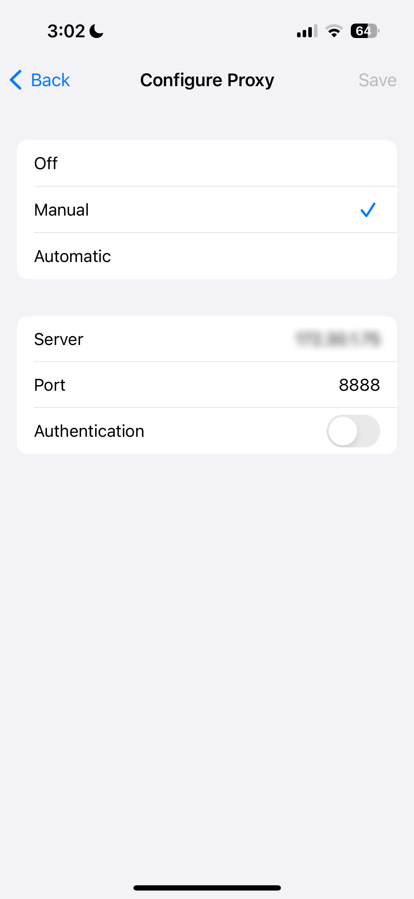
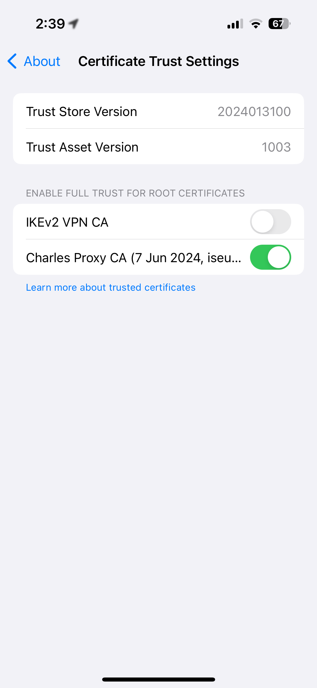
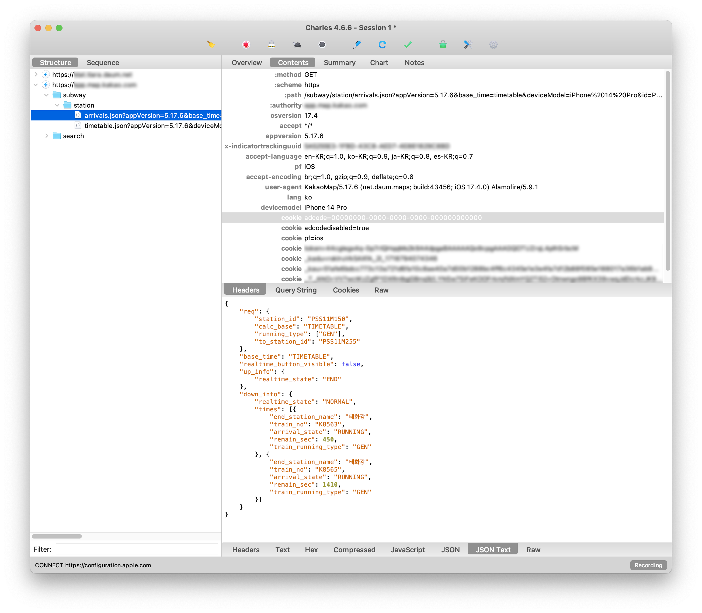
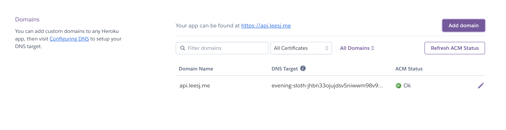
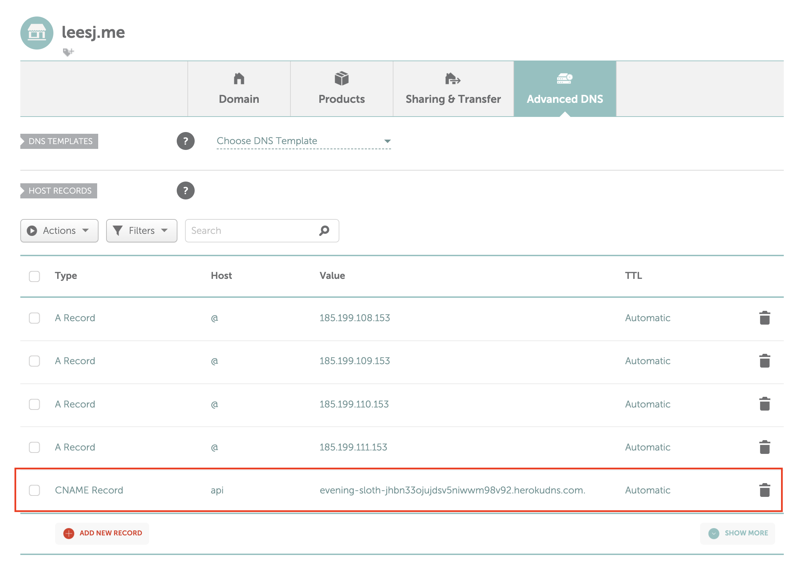

## 0. 들어가며
부산 지하철 실시간 도착정보 서비스를 만들기 위해 가장 먼저 준비해야 하는 것은 그 **실시간 도착정보를 찾아내는 것**이다. [공공데이터포털](https://data.go.kr), [레일포털](https://data.kric.go.kr), [카카오맵 API](https://apis.map.kakao.com/web/) 등을 모두 찾아 보았으나, OpenAPI 형태로 실시간 도착정보를 제공하는 곳은 없었다. 어쩔 수 없이 카카오맵 앱 내부적으로 사용되는 API를 사용하여 실시간 도착정보를 찾아내기로 했다. 이 내부 API는 외부에 공개되지 않기 때문에 네트워크 패킷을 분석하여 찾아내야 한다.

## 1. 카카오맵 내부 API 찾아내기
휴대폰에서 통신되는 네트워크 패킷을 컴퓨터에서 찾아낼 수 있는 소프트웨어를 검색해보니 [Charles Proxy](https://www.charlesproxy.com/download/)가 있었다. 30일 무료 평가판에 세션 시간 제한 등 제약이 있었지만, 카카오맵 내부 API를 찾아내는 데에는 문제가 없어 보였다. Charles Proxy를 Mac에 설치한 뒤 iPhone에서 몇 가지 설정을 만져 주었다.

### 1-1. iPhone Wi-Fi 설정 변경
iPhone을 컴퓨터와 동일한 Wi-Fi 네트워크에 연결하고, `Settings > Wi-Fi > 해당 네트워크 옆 🛈`을 누르고 맨 밑으로 내려 `Configure Proxy`를 `Manual`로 바꿔주었다. Server는 컴퓨터의 IP 주소, Port는 `8888`로 설정하였다.



### 1-2. iPhone에 SSL 인증서 설치
iPhone의 Safari에서 [SSL 인증서](https://chls.pro/ssl)를 다운로드하여 설치하고, `Settings > General > About > Certificate Trust Settings > Enable Full Trust for Root Certificates` 경로로 가서 Charles Proxy의 인증서를 활성화하였다.



### 1-3. Charles 실행
카카오맵 앱에서 길찾기를 누르고 지하철이 포함된 동선으로 경로를 검색하면 Charles에서 요청을 보내는 링크를 확인할 수 있다. 외부에 공개된 API가 아니기 때문에 실제 링크 대신 가칭인 `https://api.kakao.com/subway`로 대체하였다.
* 특정 역에서의 실시간 도착정보: `https://api.kakao.com/subway/station/arrivals.json?id=${stationID}`
* 특정 역의 시간표: `https://api.kakao.com/subway/station/timetable.json?id=${stationID}`




## 2. 프록시 서버 구축
### 2-1. 왜 프록시 서버가 필요한가?
프론트엔드에서 해당 API를 바로 불러오면 두 가지 문제점이 발생한다.
* `문제 1`. CORS (Cross Origin Resource Sharing) 에러가 뜬다.
* `문제 2`. 이용자에게 카카오맵 API 주소가 노출되는 문제가 발생한다.

이를 해결하기 위해서 별도의 프록시 서버를 구축해야 했다.

처음에는 `cors-anywhere`라는 repo를 fork하여 Heroku에서 서버를 돌렸다. 이러한 방식을 사용하면, 단순히 https://subway-live-ef069a488429.herokuapp.com/ 뒤에 요청할 API 링크를 붙이기만 하면 되기 때문이다. 하지만 이 방법은 `문제 1`은 해결할 수 있지만, `문제 2`는 해결할 수 없었다. 따라서 직접 프록시 서버를 구축하기로 하였다.

### 2-2. Express로 간단한 서버 만들기
1. `http-proxy-middleware`라는 npm 라이브러리를 사용하여, 서버 도메인명 뒤에 `/subway`가 오면 https://api.kakao.com/subway 로 연결하는 간단한 코드를 작성하였다.
```javascript
const express = require("express");
const { createProxyMiddleware } = require("http-proxy-middleware");
const path = require("path");
const cors = require("cors");

const app = express();
const PORT = process.env.PORT || 5000;

app.use(
    "/subway",
    createProxyMiddleware({
        target: "https://api.kakao.com/subway",
        changeOrigin: true,
    })
);

app.listen(PORT, () => {
    console.log(`Server is running on port ${PORT}`);
});
```
2. 이 서버로 향하는 CORS 문제를 해결하기 위해 https://leesj.me 및 http://localhost 를 허용하였다.
```javascript
const allowedOrigins = ["http://localhost:5173", "http://localhost:5174", "https://leesj.me"];
const corsOptions = {
    origin: function (origin, callback) {
        if (allowedOrigins.indexOf(origin) !== -1 || !origin) {
            callback(null, true);
        } else {
            callback(new Error("Not allowed by CORS"));
        }
    },
    credentials: true,
};

app.use(cors(corsOptions));
```
3. `subway-live-proxy`라는 비공개 repo에 해당 파일을 넣어 Heroku에 호스트하였다. 자세한 방법은 [Docs](https://devcenter.heroku.com/articles/git)를 참고하면 된다.

### 2-3. 프록시 서버 도메인 설정
Heroku에서 기본적으로 제공하는 도메인명은 너무 길고 예쁘지가 않아 직접 도메인을 따로 설정하였다.
1. Heroku 앱의 `Settings > Domains`에서 `Add domain`을 누르고 도메인명에 `api.leesj.me`를 입력하였다. 그러면 Heroku에서 제시한 DNS Target이 나타난다.

   

2. 도메인 관리 사이트에 들어가서 DNS target을 추가해주었다. 나는 Namecheap에서 도메인을 구입하였는데, Namecheap의 `Domain List > Manage > Advanced DNS`에 들어가서 다음을 추가하였다.
   * `Type`: `CNAME Record`
   * `Host`: `api`
   * `Value`: Heroku에서 제시한 DNS Target
  
   

* 정리하면 다음과 같다.
    * Frontend `subway-live` (공개 repo): Github Pages에서 https://leesj.me/subway-live 로 호스팅
    * Backend `subway-live-proxy` (비공개 repo): Heroku에서 https://api.leesj.me 로 호스팅
    * 요청 흐름도
    > https://leesj.me/subway-live -(클라이언트의 GET 요청)→
    > https://api.leesj.me -(CNAME)→
    > https://asymmetrical-indominus-dml7yfof09cu68fzk8g6hheo.herokudns.com -(서버의 GET 요청)→
    > https://api.kakao.com/subway

### 2-4. SSL 인증 활성화
여기까지 하면 프록시 서버는 http 형태의 주소가 된다. 그런데 https (클라이언트)에서 http (프록시 서버)로 요청을 보낼 수 없기 때문에 SSL 인증을 활성화해줘야 한다. 이 옵션은 Heroku 유료 플랜을 사용하여야지만 활성화가 가능한데, 다행히도 [Github Student Developer Pack](https://github.com/edu/students)에 가입되어 있는 경우 &dollar;312의 크레딧을 제공해주어 무료로 사용이 가능했다.
    Terminal에서 Heroku CLI를 통해 활성화하면 된다.
    ```sh
    heroku certs:auto:enable -a subway-live-proxy
    ```

```toc
```