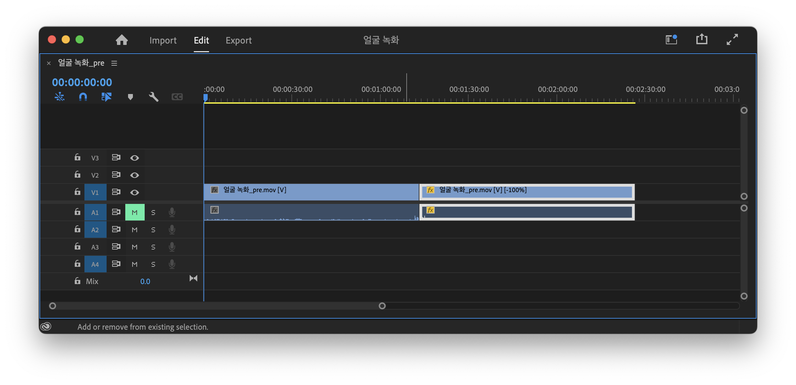
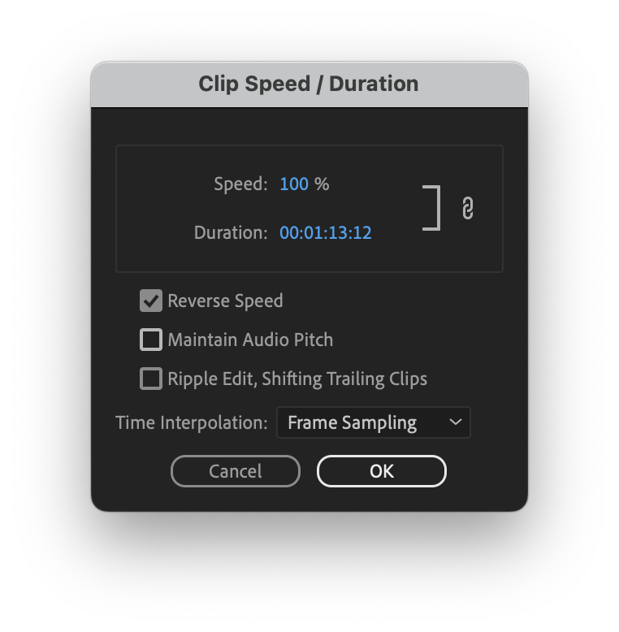
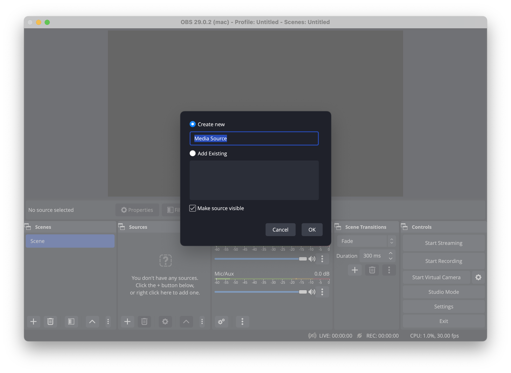
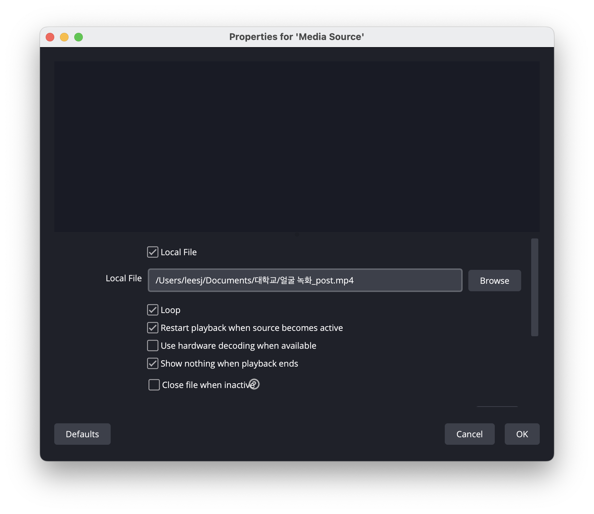
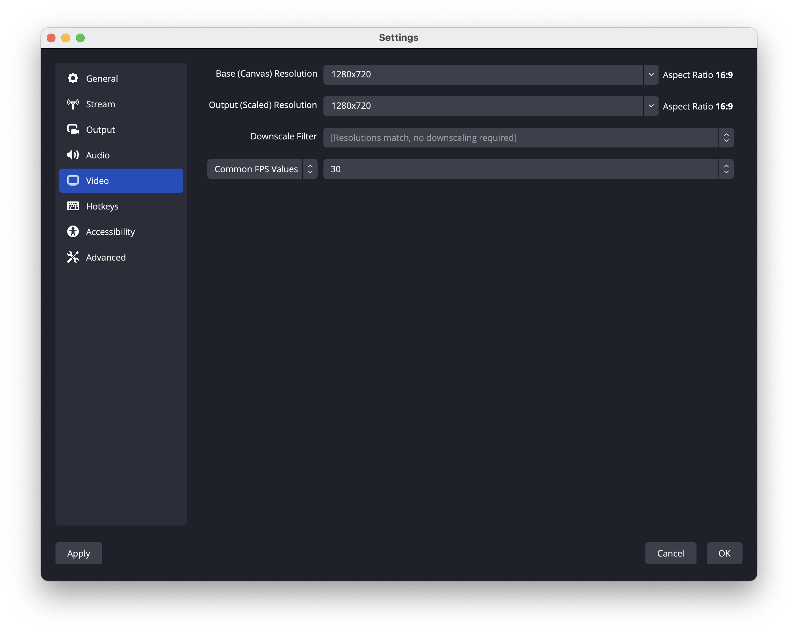
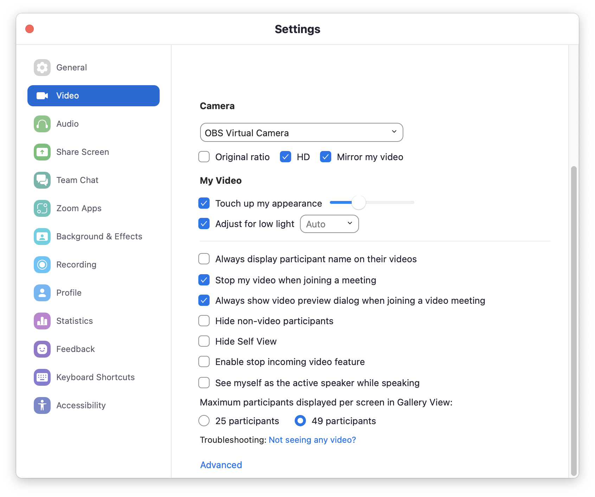

## 0. Intro
온라인 수업을 듣다가, 문득 눕고 십다는 생각을 해본 적이 있을 것이다. 하지만 누워서 수업을 듣는 자신의 모습을 카메라에 비출 수는 없지 않은가. (실제로 어떤 사람이 누워서 수업을 듣다가, 교수님이 뭐라 하신 상황을 목격한 바 있다.)
그렇게 해서 고안해낸 것이, 수업을 듣고 있는 자신의 모습을 촬영한 후 이것을 카메라 모습 대신에 활용하는 방안이다.

## 1. 영상 만들기
먼저 자신의 모습을 웹캠으로 약 1~2분 간 촬영한다. Mac의 경우, QuickTime Player의 `New Movie Recording` 방식으로 쉽게 촬영할 수 있고, Windows의 경우에는 OBS (Open Brodcaster Software)을 활용하여 녹화하면 된다.

다음 과정은 그 영상을 역재생한 영상과 이어붙이는 과정이다. 만약 이 과정을 생략한다면, 영상을 끝까지 재생하고 난 후 처음 프레임으로 돌아갈 때 툭 끊기게 될 것이기 때문이다. 이 글에서는 Adobe Premiere Pro CC를 이용할 것이다.
영상을 Import하여 Sequence에 넣은 후 Timeline에서 같은 영상을 하나 더 복제하여 오른쪽에 둔다.

이후 우클릭하여 `Clip Speed/Duration`에서 `Reverse Speed`를 체크해주면 된다.



마지막으로 `File > Export > Media` 탭에서 영상을 export한다.


만약 Adobe Premiere Pro가 없다면, iMovie나 Adobe Premiere Rush 등 프리웨어를 활용하여 비슷한 과정을 해주면 된다.

## 2. Zoom에 적용시키기
Zoom이 영상을 하나의 카메라로 인식하기 위해서는 크게 두 가지 방법이 있다.

1. Zoom 내의 Virtual Background 기능을 활용한다. Zoom의 `Settings`에 들어가서 `Background & Effects` 탭에서 `Add Video`를 누르고 해당 영상을 넣어준다. Zoom 회의 시에는 카메라를 켠 상태에서 웹캠에 자신이 얼굴이 촬영되지 않도록 웹캠을 물리적으로 가리되, 만약 교수님에게 호출(?)당한다면 얼른 Virtual Background를 끄거나 Blur로 바꾼 후 웹캠을 가린 물체를 제거해야 한다.

2. 조금 더 편한 방법은 [OBS](https://obsproject.com/)의 Virtual Camera 기능을 사용하는 것이다. 프로그램을 실행한 후 왼쪽 하단의 `Scenes`에 아무 것도 없다면 새로운 Scene을 추가해준다. 이후 그 Scene을 클릭한 상태에서 `Sources` 탭에서 `Media Source`를 추가해준다.

OK를 누르면 아래 창에 뜨는데, `Local File`이 체크가 된 상태에서 `Browse`를 누르고 편집한 영상의 경로를 불러온다. 이후 `Loop`를 체크하고 `OK`를 누른다.

간혹 출력 화면에 영상이 꽉 차지 않는 경우가 있는데, 이 경우에는 `Settings > Video`에 있는 `Base (Canvas) Resolution`과 `Output (Scaled) Resolution`을 모두 촬영한 영상의 해상도와 동일하게 맞춰준다. (일반적으로 1280x720 또는 1920x1080일 것이다.)

마지막으로 OBS에서 `Start Virtual Camera`를 누르고, Zoom의 `Settings > Video > Camera`를 `OBS Virtual Camera`로 바꿔준다. (만약 뜨지 않는다면, 컴퓨터를 재시작해보는 것이 좋다.) 이 경우에서 교수님에게 호출당한다면 Zoom의 `Start Video` 탭에서 카메라만 웹캠으로 바꿔주면 되기에 훨씬 간편한다. 다만, 그 transition이 부자연스러울 것이므로 카메라를 수 초 끈 다음에 다시 웹캠으로 바꿔서 켜는 것을 추천한다.


## 3. 마무리
언제까지나 임시적 방편에 불과하므로 실제 자신의 카메라를 켜게 될 상황이 자주 있을 경우에는 사용하지 않는 것을 추천하며, 자신의 영상을 촬영한 배경과 실제 Zoom 회의 시의 배경이 가급적 동일한 것이 좋다. Zoom 이외에도 Google Meet나 Skype 등 다른 플랫폼에서도 가능한지에 대한 여부는 [이 table](https://github.com/johnboiles/obs-mac-virtualcam/wiki/Compatibility)을 참고하면 될 것 같다.

```toc
```
